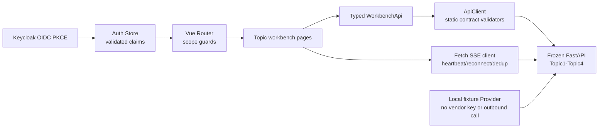

# Frontend Workbench Architecture

## Scope

The Vue 3 workbench is the presentation and interaction layer above the
frozen Phase1.1-Topic4 API. It does not alter PostgreSQL migrations, RLS
policies, Outbox semantics, SSE cursors, verification state transitions, or
C12 release transactions.

## Layers

| Layer | Location | Responsibility |
| --- | --- | --- |
| App composition | `frontend/src/app` | Router, shell, dependency injection |
| Identity | `frontend/src/auth`, `frontend/src/stores/auth.ts` | PKCE, session storage, claim validation, logout cleanup |
| Account lifecycle | `frontend/src/identity`, identity pages | registration challenges, profile CAS, verified contact changes, tenant account administration |
| Internationalization | `frontend/src/i18n` | `zh-CN`, `zh-TW`, `en-US`, Keycloak locale mapping, date/number formatting |
| Transport | `frontend/src/api/client.ts`, `frontend/src/streaming/sse.ts` | approved headers, trace/session IDs, runtime envelope checks, stream replay |
| API facade | `frontend/src/api/facade.ts`, `frontend/src/api/types.ts` | one typed method per frozen endpoint; URL and idempotency ownership |
| Shared UI | `frontend/src/shared/components` | status, risk, evidence, hash, report, release and empty-state controls |
| Feature pages | `frontend/src/pages` | Topic1 graph, Topic2 learning, Topic3 agents, Topic4 verification/release/review |
| Local demo Provider | `infra/mock-provider` | deterministic Responses Lite fixtures for approved Topic3 aliases |

## Trust Boundary

The browser receives `tenant_id`, roles and permissions only from the validated
OIDC profile. It uses the tenant identifier for display and session-cache
partitioning, but never sends it as a request header. All authoritative hashes,
Candidate/Report identities, allowed release blocks and authorization expiry
are loaded or derived by the server.

The C12 UI sends only `verification_id`, requested release mode, an optional
server-known block subset and a TTL capped at 300 seconds. Commit sends only
the returned `authorization_id`. A stale or replayed authorization is rejected
by the backend; the UI displays the safe error receipt.

The frontend does not expose the endpoint that accepts a complete
`VerificationRequestPayloadV1`. For navigation, it projects the server-issued
Candidate ID, version, and SHA through the same frozen UUIDv5 rule used by the
backend, then loads the persisted Verification from the read API. The projected
identifier is not a release credential or an authority source.

Every mutating control has a fine-grained Scope guard in addition to route
access. Read-only identities can inspect records without being shown an enabled
memory refresh, path generation, Agent generation, verification requeue, review,
or release action.

## Account Lifecycle

Keycloak is the credential authority. Public email/phone registration uses
versioned backend contracts, a server-owned challenge, and an operation-stable
`Idempotency-Key`. The browser submits a password only over the protected
registration request and clears the local form after success. It never stores
the password, verification code, invitation token, Keycloak management token,
tenant assignment, role, or Scope.

Application account pages project only non-sensitive profile data. Email and
phone changes require a new challenge. Profile and account status mutations
carry server versions for CAS and preserve the same idempotency key across an
ambiguous retry. Tenant account responses are compared with the tenant from the
validated OIDC identity before rendering.

## Contract Validation And CSP

`frontend/tools/generate-validators.mjs` compiles the selected frozen JSON
Schemas and the existing Topic envelope checks into deterministic AJV
standalone ESM. Generated source and declarations are committed and checked
for drift on Windows and Linux. The runtime facade imports only static
validation functions; it does not instantiate AJV or call `eval`, `Function`,
or CommonJS `require`.

This keeps production `script-src 'self'` intact without `unsafe-eval`. Nginx
applies the same security headers to SPA, asset, public API, protected API, and
health responses. Hashed assets are immutable; HTML and API responses are
`no-store`.

## Streaming

`SseClient` uses `fetch()` and `ReadableStream`, because native `EventSource`
cannot carry the Bearer token. Cursors are stored under a tenant and stream
key in `sessionStorage`. Event IDs and server sequences are deduplicated before
page state changes. A tenant change, logout, 401 or 403 clears all cursors and
tenant-scoped caches.

## Responsive Design

The shell uses a fixed desktop navigation rail and a mobile drawer. Dense data
surfaces use tables, timelines, lists and a graph canvas; repeated items are
not wrapped in nested decorative cards. Print styles expose only the report
section for browser PDF export.

Public identity surfaces and the authenticated shell share the same locale
catalog. The locale is session-scoped, is cleared with the browser session, and
is passed to Keycloak only through the standard `ui_locales` OIDC parameter.

## Local Fixture Boundary

`infra/mock-provider/server.py` is a standard-library-only HTTP service. It
accepts only the Compose-local bearer token, caps request size, emits frozen
Topic3 content schemas, performs no outbound request, and runs as UID/GID
`10002:10002` in a read-only container. It is a development fixture, not a
replacement for real provider conformance testing.
