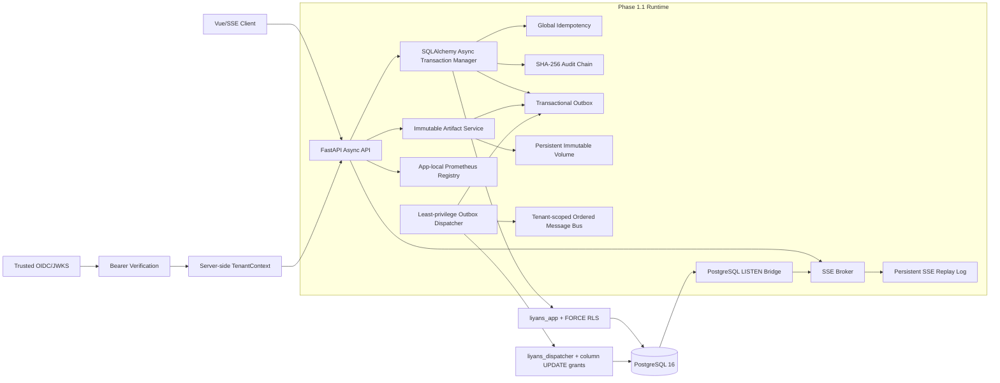
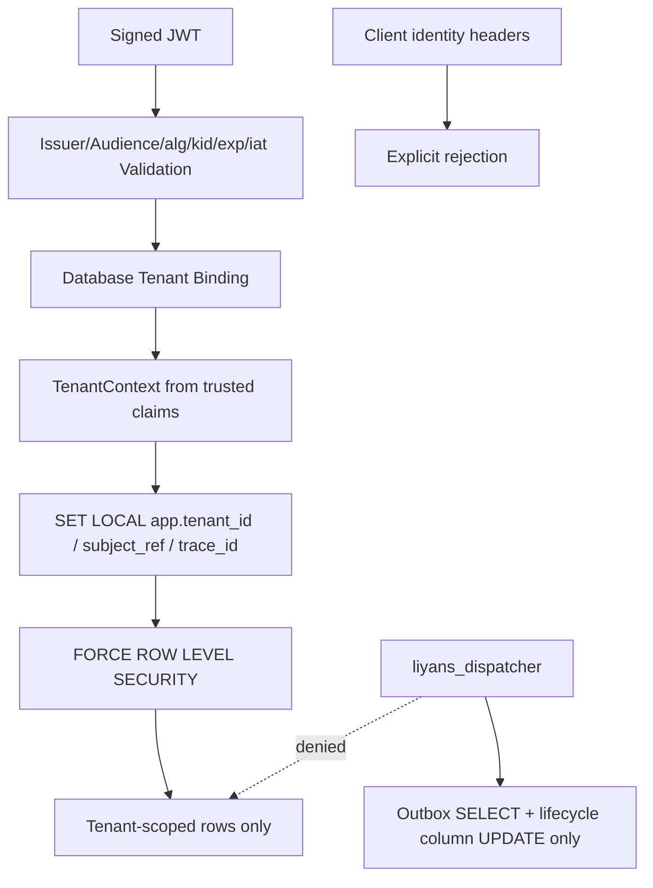

# Phase 1.1 生产级持久化、租户身份与事务消息基础设施正式验收报告

## 1. 文档状态

| 属性 | 值 |
|---|---|
| 阶段 | Phase 1.1 |
| 基线分支 | `codex/phase-1.1-foundation` |
| 本地验收状态 | 通过 |
| 远端发布验收状态 | 待目标 GitHub 仓库绑定 |
| 上层系统解锁状态 | 锁定 |
| 冻结原则 | 远端 `Release quality redline` 成功且 `main` 保护生效后方可最终冻结 |

本报告区分“本地工程验收”和“远端发布验收”。本地工程验收已经证明代码、
数据库、容器、契约、供应链清单和故障恢复能力成立；由于当前 Git 仓库没有任何
远端地址，无法伪造远端 Actions 结果或分支保护状态。因此 Phase 1.1 仍保持发布
闸门关闭，Topic 1/2 业务绑定、五大 Agent 和 Verifier 实现不得提前进入。

## 2. 最终架构冻结



### 2.1 事务消息数据流

```mermaid
sequenceDiagram
    participant S as Artifact/Application Service
    participant DB as PostgreSQL Transaction
    participant O as Outbox Table
    participant D as Dispatcher Role
    participant B as Ordered Message Bus
    participant I as Idempotency Store

    S->>DB: BEGIN with tenant RLS context
    S->>DB: Persist state mutation
    S->>O: Append frozen Envelope in same transaction
    DB-->>S: COMMIT
    D->>O: Claim contiguous partition head with SKIP LOCKED
    D->>B: Restore tenant + partition durable cursor
    B->>I: Reserve digest-bound idempotency key
    B-->>D: PROCESSED or DUPLICATE_COMPLETED
    D->>O: Mark PUBLISHED
    Note over D,O: Failure releases with bounded backoff; exhausted rows become DEAD
```

### 2.2 多租户安全隔离



## 3. 八步建设结果

| Step | 验收结果 | 冻结资产 |
|---|---|---|
| 1. Git 基线 | 通过 | 独立 `codex/` 分支、顺序提交、可回滚历史 |
| 2. 依赖锁 | 通过 | Python 3.11、uv 0.11.28、`uv.lock`、Node/pnpm/Go 版本基线 |
| 3. 异步事务 | 通过 | 异步引擎、托管会话、嵌套事务、隔离级别、重试与回滚 |
| 4. Alembic | 通过 | 租户、Artifact、幂等、Outbox、审计链、SSE 事件及 dispatcher/SSE trigger |
| 5. PostgreSQL 能力 | 通过 | RLS、事务 Outbox、持久化幂等、审计证据链、SSE 重放 |
| 6. 身份与租户 | 通过 | OIDC/JWKS、JWT 强校验、数据库授权、客户端身份头禁用 |
| 7. 集成测试 | 通过 | 事务、隔离、重启恢复、并发冲突、dispatcher、双实例 SSE |
| 8. CI/CD 门禁 | 本地通过，远端待绑定 | Actions、SBOM、许可证、审计、Ruff、Go、Vue、容器、Gitleaks、Trivy |

## 4. 隐藏缺口回补结果

### 4.1 Artifact 持久化

- 内容以 SHA-256、字节长度和不可变对象键绑定。
- 文件创建采用临时文件、`fsync` 和原子硬链接，拒绝路径穿越和符号链接。
- Artifact 元数据与 Outbox Envelope 在同一 PostgreSQL 事务提交。
- 生命周期迁移可与对应 Outbox 事件原子提交。
- 跨租户读取返回不存在语义，不泄露对象存在性。
- 生产部署边界为持久化共享卷；多节点部署必须提供符合相同接口和不可变语义的
  共享存储，单机临时目录不属于通过配置。

### 4.2 Outbox 发布恢复

- 独立 `liyans_dispatcher` 角色不具备超级用户、继承或 `BYPASSRLS` 能力。
- 角色只能读取 Outbox，并更新 claim/retry/publish 生命周期列，无法修改租户、
  Envelope、分区键或序列。
- 仅领取每个租户分区的连续头部；缺失序列 0 或 DEAD 头部不会被越过。
- `FOR UPDATE SKIP LOCKED` 保证多 dispatcher 不重复领取。
- 进程崩溃后租约恢复；消费者已完成但 Outbox 未确认时，通过持久化幂等记录将
  第二次投递识别为 `DUPLICATE_COMPLETED` 并完成发布确认。
- Message Bus 内部游标按 `(tenant_id, partition_key)` 隔离，消除跨租户同名分区冲突。

### 4.3 多实例 SSE

- SSE 事件先持久化，提交后由 PostgreSQL trigger 发出固定频道通知。
- 每个 API 实例使用有界 LISTEN 队列；通知丢失、溢出和重连均从持久化序列补洞。
- 本地直接发布与数据库通知通过订阅者序列游标去重。
- 重放校验租户、连续序列、大小、JSON 有限值和持久化 SHA-256。
- 慢订阅者队列满时主动断开，避免单个连接拖垮进程；客户端使用签名
  `Last-Event-ID` 恢复。

### 4.4 可观测性与就绪闸门

- `/metrics` 使用每个 FastAPI 应用独立的 Prometheus registry，避免重复注册。
- HTTP、数据库、Outbox、SSE 和组件就绪状态均有低基数指标。
- 指标标签不包含原始租户 ID、用户 ID 或请求路径参数。
- `/health/live` 仅表示进程存活；`/health/ready` 同时要求数据库、OIDC、任务队列、
  Message Bus、Outbox publisher 和 SSE bridge 可用。
- 开发 Compose 没有身份提供方，因此容器健康检查使用 liveness；生产流量闸门必须
  使用 readiness。

## 5. 量化验收证据

| 验收项 | 结果 |
|---|---:|
| Python/契约/集成测试 | 103 passed |
| Windows 符号链接能力相关用例 | 1 skipped，Linux CI 必须执行 |
| Python 行覆盖率 | 85.00% 红线通过；完整本地运行观测区间 85.37%-85.54% |
| Alembic upgrade -> base downgrade -> upgrade | 通过 |
| Alembic model drift | 0 |
| Ruff lint/format | 0 findings |
| Actionlint | 0 findings |
| Go fmt/vet/race/test/build | 通过 |
| Vue/TypeScript/Vite build | 通过 |
| pnpm high/critical audit | 0 |
| Python `pip-audit --strict` | 0 |
| Node SBOM | 139 components，许可证策略通过 |
| Python SBOM | 98 components，许可证策略通过 |
| Gitleaks history/worktree | 0 findings |
| Trivy 完整漏洞库存 | CRITICAL/HIGH/MEDIUM/LOW/UNKNOWN 均为 0 |
| Trivy 可修复 HIGH/CRITICAL 红线 | 0 |
| Container user | `10001:10001` |
| Container base | digest-pinned official Python 3.11 Alpine |
| Runtime source/dev tools | 未包含源码、pytest、pip、setuptools、wheel |
| Persistent volume write | 非 root 写入通过 |
| Compose migration head | `20260715_0003` |
| Compose Outbox publisher | healthy |
| Compose SSE notification bridge | connected |
| 性能烟雾基线 | 32 SSE subscribers x 64 events；32 partitions x 16 messages，均在 10s 红线内 |

### 5.1 尚未计为通过的发布证据

本地 Trivy 已通过官方 AWS Public ECR 漏洞库完成全量扫描，并独立执行 fixable
HIGH/CRITICAL 阻断扫描。最终 digest-pinned Alpine 运行时的完整库存为 0，当前发布
红线内的可修复 HIGH/CRITICAL 同样为 0。

1. Git 仓库没有远端 URL，不能执行 GitHub Actions、获取不可伪造的 run URL，也不能
   应用 `main` 分支保护。
2. 因此还不能证明同一提交在 GitHub 托管 Linux 环境通过全部门禁，也不能证明所需
   状态检查无法被绕过。

上述任一项未完成时，`acceptance-status.json` 必须保持 `REMOTE_PENDING`。

## 6. Step 8 发布质量红线

最终 GitHub Actions 聚合任务名固定为 `Release quality redline`，并要求以下任务全部
成功，取消或跳过同样视为失败：

1. Actionlint、uv lock、Ruff、契约再生成和单元测试；
2. PostgreSQL 16 真实角色、迁移双向循环、全量回归和覆盖率；
3. Go formatter、module drift、vet、race、test 和 build；
4. Vue/TypeScript/Vite、pnpm audit、Node SBOM 和许可证策略；
5. Python 精确依赖审计、CycloneDX 和许可证策略；
6. digest-pinned 非 root 容器、SBOM、完整漏洞库存和可修复 HIGH/CRITICAL 红线；
7. Git 全历史和工作树密钥扫描。

`main` 必须要求 PR、至少一名 Code Owner 审核、解决全部会话、线性历史、管理员同样
受约束，并禁止 force-push 与删除。

## 7. 风险与兜底

| 风险 | 当前控制 | 触发后的处理 |
|---|---|---|
| PostgreSQL 暂时不可用 | pool pre-ping、超时、就绪降级 | 停止接流量；事务回滚；Outbox 租约恢复 |
| Dispatcher 崩溃 | claim lease + durable idempotency | 新实例回收租约，不重复执行业务副作用 |
| SSE 通知丢失 | durable replay + reconnect sync | 补齐序列；超出保留窗则断开并要求完整重建 |
| 慢 SSE 客户端 | 有界队列和背压断开 | 客户端带签名游标重连 |
| Artifact 写后 DB 失败 | 不可变键与幂等重试 | 同内容重试复用；部署运维任务按宽限期盘点无元数据对象 |
| OIDC 不可用 | 启动/请求 fail-closed、readiness 503 | 不接受客户端身份头或匿名内部调用 |
| 漏洞库网络失败 | CI fail-closed、完整 JSON 证据 | 重跑网络故障，不允许以跳过扫描方式合并 |
| 远端状态绕过 | 单一聚合红线 + branch protection | 无直推 `main` 例外 |

## 8. 上层系统解锁条件

只有同时满足以下条件，才将状态改为 `ACCEPTED`：

1. Step 8 资产提交后工作树干净；
2. 目标远端身份由项目所有者明确确认；
3. `codex/phase-1.1-foundation` 推送成功；
4. 该提交对应的 GitHub Actions `Release quality redline` 为 success；
5. Trivy 完整库存生成，fixable HIGH/CRITICAL 为 0；
6. `main` 分支保护经 API 回读确认；
7. 远端 run URL、commit SHA、SBOM 和测试证据写入验收台账。

最终解锁顺序固定为：

1. Topic 1 冻结数据模型的 repository/service 绑定；
2. Topic 2 画像和路径算法的持久化绑定；
3. Topic 3 五大 Agent 运行时实现；
4. Topic 4 Verifier 与反向修正链路；
5. Vue 业务工作台与 SSE 交互；
6. 全系统安全、压力、恢复和竞赛最终验收。

任何上层实现不得反向修改 Phase 1.1 的租户信任边界、事务约束、Envelope 语义、
Outbox 连续序列规则、审计证据链或 SSE 持久化协议。
