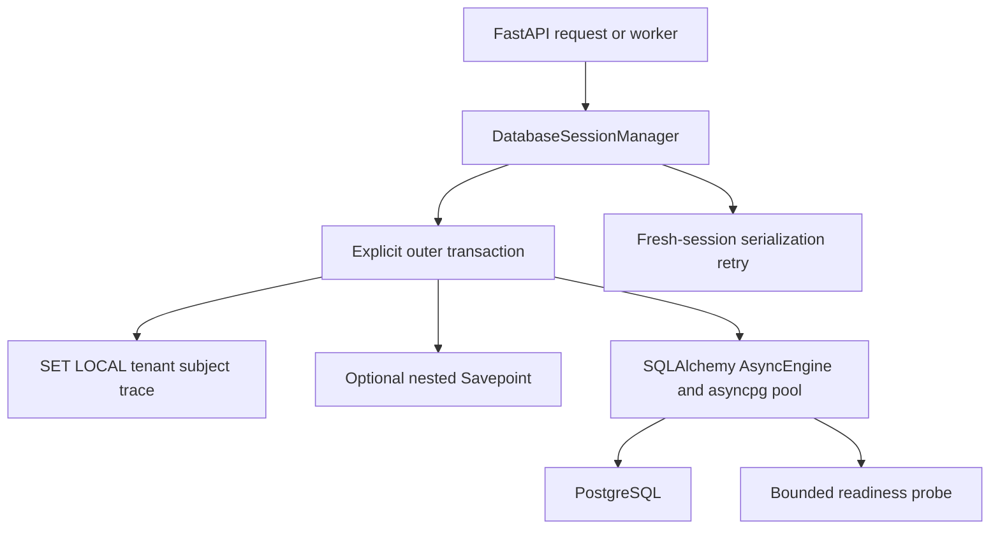

# Phase 1.1 Step 3: Async Database Runtime

## Layered architecture

## Engineering rules

- Only `postgresql+asyncpg` is accepted in production runtime configuration.
- One process owns one engine and one session factory.
- FastAPI lifespan owns the database runtime and disposes its pool on shutdown.
- AsyncSession is never shared across requests, workers, or concurrent tasks.
- `autobegin=False` prevents accidental implicit transactions.
- Every transaction commits only after the operation returns successfully.
- Exceptions and cancellation roll back before the session closes.
- Nested units use PostgreSQL Savepoints and cannot exist without an outer transaction.
- Tenant, subject, and trace values are transaction-local PostgreSQL settings.
- SQLSTATE `40001` and `40P01` may retry only in a new transaction and session.
- Unique, authorization, and validation errors are never retried automatically.

## Pool controls

Default API process limits are pool size 10, overflow 20, checkout timeout 10
seconds, recycle 1800 seconds, statement timeout 30 seconds, and idle transaction
timeout 60 seconds. Deployment capacity planning multiplies these values by the
number of API and worker processes and must remain below PostgreSQL connection limits.

## Acceptance

- Explicit transaction commit and exception rollback tests pass.
- Savepoint use without an outer transaction is rejected.
- Retryable SQLSTATE classification is deterministic.
- Non-PostgreSQL runtime URLs fail closed.
- Ruff and the complete regression suite pass.

## Failure containment

Pool exhaustion returns a bounded infrastructure failure rather than waiting
indefinitely. Database health probes have independent deadlines, and readiness
fails closed with HTTP 503 while PostgreSQL is unavailable. A serialization retry
never reuses a failed session. Database uncertainty prevents outbox and publication
acknowledgement in later steps.
