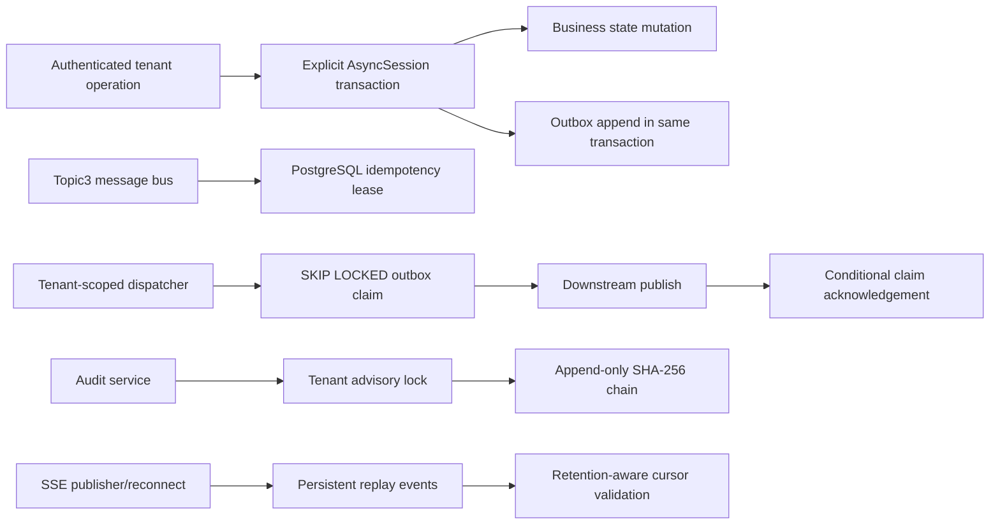

# Phase 1.1 Step 5: PostgreSQL Durable Adapters

## Layered architecture

## Transaction and consistency rules

- An Outbox row is appended through the exact `AsyncSession` that owns the
  business state mutation. No adapter-owned commit is allowed in `append`.
- Dispatch claims use row locks with `SKIP LOCKED`; only the worker named in the
  active lease may publish-confirm or release the row.
- Expired Outbox claims return to `PENDING` while budget remains and become
  `DEAD` after the final attempt.
- Idempotency reservations are unique per tenant and key. The immutable request
  digest detects key reuse for different payloads.
- A stale processing lease may be taken over. Completion and abort require the
  active lease owner; completed records are stable and replay-safe.
- Audit sequence allocation is serialized per tenant with a transaction advisory
  lock. PostgreSQL RLS and the append-only trigger remain active during writes.
- SSE sequence allocation is serialized per tenant. Expiry cleanup retains each
  tenant's highest sequence as a persistent watermark, preventing sequence reuse
  after all visible events expire.

## Runtime wiring

FastAPI now uses PostgreSQL implementations by default:

- `PostgresIdempotencyStore` for Topic3 message delivery.
- `PostgresOutboxRepository` for transactional event publication.
- `PostgresAuditStore` for durable evidence.
- `PostgresSSEReplayLog` for reconnect and recovery.

The JSONL and in-memory stores remain test doubles only. They are not the
production runtime path.

## Performance and safety targets

- Idempotency reserve p95 below 20 ms at steady state.
- Outbox claim batch of 100 rows p95 below 50 ms on the dispatch index.
- No duplicate claim acknowledgements under competing workers.
- Audit append p95 below 30 ms per tenant; different tenants remain parallel.
- SSE append p95 below 20 ms and replay of 1000 events below 100 ms.
- Zero sequence reuse after restart or retention cleanup.
- Zero cross-tenant rows returned without a matching transaction context.

## Failure containment

Database uncertainty prevents publication acknowledgement. A failed business
transaction rolls back its Outbox row. A worker crash leaves a bounded lease that
another worker can recover. Audit failure remains fail-closed for critical actions.
Invalid or stale SSE cursors return a controlled 409 and require a fresh snapshot.

## Automated acceptance

The standard suite validates interfaces and migration SQL without external
services. `backend/tests/integration/test_postgres_adapters.py` activates when
`LIYAN_TEST_DATABASE_URL` and `LIYAN_TEST_MIGRATION_DATABASE_URL` are present and
executes all four adapters against PostgreSQL.
