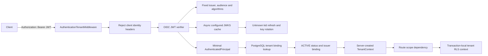

# Phase 1.1 Step 6: OIDC and Tenant Authorization

## Security architecture

## Trust boundary

The API no longer consumes `X-Tenant-Id`, `X-Subject-Ref`, `X-Roles`, or
`X-Scopes`. Requests carrying these headers are rejected before token parsing.
Tenant, subject, roles, and scopes come only from a cryptographically validated
JWT and a database-backed tenant authorization decision.

The client may send a trace identifier and learning session identifier, but
neither field grants identity or tenant authority. Trace values are format
checked; session ownership is enforced by business repositories when those
resources are implemented.

## JWT and JWKS controls

- Allowed algorithms are asymmetric only: RS256/384/512 and ES256/384.
- `none`, HS-family algorithms, token-provided `jku`, and token-provided `x5u`
  are rejected.
- Issuer, audience, and JWKS URI come exclusively from server configuration.
- Production requires HTTPS issuer and JWKS endpoints.
- Required claims are `iss`, `aud`, `sub`, `iat`, `exp`, and the configured
  tenant claim.
- Maximum token lifetime defaults to one hour; clock skew defaults to 30 seconds.
- JWKS documents are size and key-count bounded, keys must be signature keys,
  duplicate `kid` values fail closed, and unknown `kid` triggers one refresh.
- The raw bearer token is never stored in request state, logs, audit metadata,
  or database rows.

At startup, a configured verifier fetches and validates JWKS before readiness can
succeed. If OIDC is intentionally unconfigured in development, internal routes
return 503 and readiness reports `authentication: unconfigured`.

## Tenant authorization

After signature verification, `PostgresTenantAuthorizer` performs a tenant-scoped
RLS query and requires:

- the internal tenant row exists;
- tenant status is `ACTIVE`;
- the tenant has a non-null issuer and external tenant binding;
- the bound issuer and tenant claim exactly match the Principal.

The query uses the already validated tenant claim only to establish a restricted
RLS context. Unknown, suspended, deprovisioned, unbound, or mismatched tenants are
denied before route execution.

## Route permissions

- Envelope validate/adapt: `topic3:validate`
- SSE publish: `topic3:sse:publish`
- SSE reconnect/read: `topic3:sse:read`

Scope checks are deny-by-default and return 403 without changing tenant context.
Roles are retained in the Principal for later policy composition but do not bypass
scope requirements.

## Acceptance thresholds

- Zero internal endpoints accept client-controlled tenant or role headers.
- Missing/invalid/expired/wrong-audience/wrong-issuer JWTs return 401.
- Authentication service unavailability returns bounded 503, never anonymous access.
- Cross-issuer and inactive-tenant authorization returns 403.
- JWKS is fetched once during a valid cache window; rotated unknown keys refresh once.
- Valid token verification p95 target is below 5 ms from warm in-process cache.
- Tenant authorization p95 target is below 20 ms on the tenant primary key.
- All 401 responses contain `WWW-Authenticate: Bearer`.

## Failure containment

JWKS expiry plus network failure is fail-closed. A tenant status or binding change
takes effect on the next request because database authorization is not cached.
SSE generators explicitly restore the authorized tenant ContextVar for the stream
lifetime, preventing asynchronous iteration from escaping RLS context.
