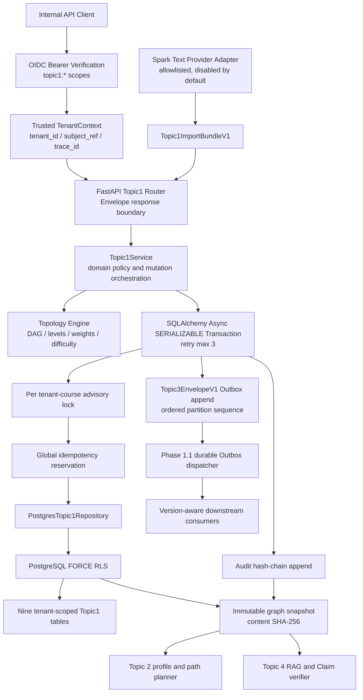

# Topic 1 自动控制原理知识拓扑工程架构

## 1. 模块定位

Topic 1 是系统唯一权威课程事实源，负责维护课程、知识点、先修依赖、专业易错点、
教材章节映射、黄金题库和不可变图谱快照。Topic 2 只能读取已冻结图谱构建学习路径，
Topic 3 只能通过版本化事实引用生成教学资源，Topic 4 只能把快照及其来源哈希作为 RAG
和 Claim 核验的权威证据，不得绕过 Topic 1 直接构造课程事实。

本实现严格复用 Phase 1.1 的异步事务、OIDC/JWKS、TenantContext、PostgreSQL FORCE RLS、
全局幂等、Outbox、审计哈希链和 Topic 3 Envelope，不修改任何冻结基础设施语义。

## 2. 分层架构与数据流



## 3. 持久化模型

| 表 | 主键或唯一边界 | 作用 | 不变量 |
|---|---|---|---|
| `topic1_courses` | `(tenant_id, course_id)` | 课程根实体 | 租户内课程编码唯一 |
| `topic1_knowledge_points` | `(tenant_id, kp_id)` | 知识点与难度、拓扑指标 | 必须归属同租户课程 |
| `topic1_prerequisites` | `(tenant_id, edge_id)` | 有向先修依赖 | 禁止自环，服务层禁止任意环 |
| `topic1_misconceptions` | `(tenant_id, misconception_id)` | 专业易错模式 | 必须引用有效知识点 |
| `topic1_textbooks` | `(tenant_id, textbook_id)` | 权威教材 | 租户内 ISBN 唯一 |
| `topic1_textbook_sections` | `(tenant_id, section_id)` | 章节层级 | 禁止章节自指 |
| `topic1_textbook_mappings` | `(tenant_id, mapping_id)` | 知识点与章节双向映射 | 两端实体必须存在 |
| `topic1_golden_questions` | `(tenant_id, question_id)` | 黄金题库及诊断标签 | 必须绑定权威来源和有效引用 |
| `topic1_graph_snapshots` | `snapshot_id` | 完整图谱不可变版本 | 触发器禁止更新/删除，绑定审计事件 |

所有 Topic 1 表均启用 `ENABLE ROW LEVEL SECURITY` 和 `FORCE ROW LEVEL SECURITY`。
运行角色只有工作表的必要 CRUD 权限，对快照表仅有 `SELECT, INSERT`，迁移角色同样受
FORCE RLS 约束，不具备 `SUPERUSER` 或 `BYPASSRLS`。

## 4. 写事务协议

每个写请求必须提供长度为 16 至 160 的 `Idempotency-Key`，并按以下固定顺序在一个
`SERIALIZABLE` 事务内完成：

1. 从已验证的 OIDC Principal 构造 TenantContext，客户端不得提交租户身份头。
2. 以 `operation + canonical request SHA-256` 预留全局幂等记录。
3. 获取 `topic1:{tenant_id}:{course_id}` 事务级 advisory lock。
4. 加载当前工作图，执行乐观修订号校验和领域变更。
5. 运行 DAG 校验、拓扑层级、拓扑权重和难度等级归一化。
6. 原子替换工作图实体，任何异常触发整个事务回滚。
7. 追加租户审计哈希链记录，并把审计事件外键绑定到新快照。
8. 追加完整不可变快照，版本号只增不减，回滚也生成新版本。
9. 以 `topic1:{tenant_id}:{course_id}` 为分区追加有序 Topic3 Envelope Outbox 事件。
10. 把结果写入幂等记录并提交；序列化冲突最多指数退避重试 3 次。

重复键且请求摘要相同返回首次结果；重复键绑定不同请求时返回
`MESSAGE_DUPLICATE_CONFLICT`，不会执行第二次写入。

## 5. 图谱算法

### 5.1 DAG 与循环依赖

拓扑引擎对去重后的有向边执行确定性 Kahn 排序，ready queue 和邻接遍历均按知识点 ID
排序，确保同一输入跨进程、跨平台生成相同拓扑顺序。若剩余节点不能被消费，则通过
DFS 返回显式闭环路径并以 `TOPIC1_CYCLE` 拒绝整个事务。

归一化输出对知识点、依赖边、易错点、教材、章节、映射和题目使用稳定键排序；教材章节
通过“直接映射章节 + 全部父级祖先”闭包回读。由此相同语义图谱在 Windows/Linux、不同
数据库执行计划和不同进程中产生一致的快照文档顺序与 SHA-256。

### 5.2 层级与权重

- `topology_level` 是从任意根节点到当前节点的最长路径深度。
- `descendant_count` 通过逆拓扑动态规划计算，不进行指数级全路径枚举。
- `topology_weight = 0.55 * descendant_influence + 0.45 * normalized_depth`。
- 单节点课程权重固定为 `1.0`，所有权重限制在 `[0, 1]` 并保留 6 位小数。

### 5.3 难度分级

`difficulty_score` 是教师或权威导入数据声明的稳定基线，不在无关图谱变更时覆盖。
系统使用该基线与先修数量、公式数量、学习目标数量、预计学习时长计算结构难度，再自动
更新 `difficulty_level`。该设计保证等级可随结构变化更新，同时避免把上一次计算结果再次
作为声明输入导致分数漂移。

## 6. 版本、审计与事件契约

每次成功变更都生成 `topic1.graph-changed` 事件，关键载荷如下：

```json
{
  "schema_version": "topic1.graph-changed.v1",
  "course_id": "CRS_ATC_001",
  "graph_version": 4,
  "snapshot_id": "uuid",
  "content_sha256": "64-lowercase-hex",
  "action": "PREREQUISITE_UPSERTED"
}
```

事件外层严格使用冻结的 `Topic3EnvelopeV1`，携带 tenant、subject、trace、correlation、
partition sequence、delivery idempotency 和 producer build metadata。快照内容、摘要、
审计事件和 Outbox 消息在同一事务提交，因此不会出现“业务已写入但事件或证据缺失”。

## 7. API 与权限边界

| 能力 | Scope |
|---|---|
| 课程、图谱、快照读取 | `topic1:read` |
| 课程、知识点、先修关系写入或删除 | `topic1:write` |
| 批量图谱导入 | `topic1:import` |
| 显式冻结快照 | `topic1:freeze` |
| 历史快照回滚 | `topic1:rollback` |

写接口全部要求幂等键；删除接口额外要求 `expected_revision`；批量导入限制为 5 MiB、
500 个知识点和 2500 条边。超限请求在进入持久化前返回 413，避免大对象反序列化和事务
占用构成拒绝服务风险。

## 8. Provider 边界

Topic 1 只定义 `Topic1KnowledgeParser` 异步协议和 `Topic1ParseRequest`。Provider alias
必须为 `spark_text`，源文档必须先持久化并绑定 SHA-256；Provider 返回完整
`Topic1ImportBundleV1` 后仍需经过本地契约、拓扑、权限、幂等、审计和快照校验。Provider
不能直接访问数据库，也不能绕过导入限额或自行声明租户。

仓库内置的 `data/topic1/automatic-control-principles.v1.json` 是可直接导入的课程种子资产，
包含 13 个核心知识点、15 条先修边、5 个专业易错点、教材章节映射和 5 道黄金诊断题。
该文件只保存自编摘要、结构化事实和题目，不包含教材正文；CI 会同时执行 Pydantic 契约
校验和 DAG 校验，防止公开仓库中的课程基线发生无审查漂移。

## 9. 验收红线

- 全量 Python 单元、集成和安全测试通过，覆盖率 `>=88%`。
- Alembic `upgrade -> base -> head` 与 `alembic check` 无漂移。
- 跨租户读取、并发同修订写入、循环依赖、超限导入、幂等摘要冲突全部被阻断。
- JSON Schema、Python、TypeScript、Go 四端契约生成无漂移且编译通过。
- Ruff、Go vet/race/build、Vue/TypeScript、依赖审计、SBOM、Trivy、Gitleaks 全绿。
- 远端 `Release quality redline` 通过并合并受保护 `main` 后，才允许签发 Topic 2 解锁凭证。
