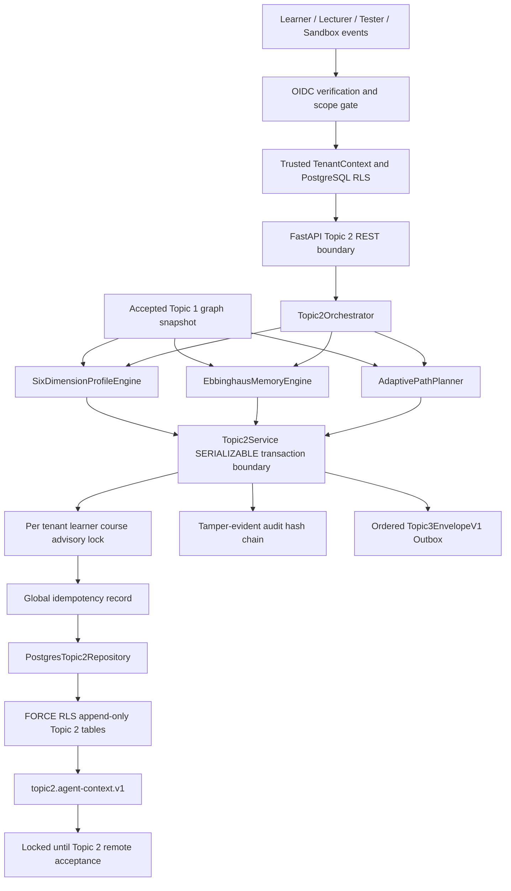

# Topic 2 六维画像、记忆衰退与自适应学习路径架构

## 1. 模块定位与冻结边界

Topic 2 是个性化学习运行时。它只读取已 `ACCEPTED` 的 Topic 1 知识图谱，持续消费学习行为，生成六维画像、知识点记忆状态和版本化学习路径，并以冻结的 `topic3.envelope.v1` 向后续 Agent 提供唯一的个性化上下文。

本实现不修改 Phase 1.1 的 OIDC/JWKS、TenantContext、SQLAlchemy Async、PostgreSQL FORCE RLS、全局幂等、Outbox、审计哈希链和持久化 SSE 语义，也不修改 Topic 1 的表、契约、图算法或快照哈希。Topic 3 Agent 与 Topic 4 Verifier 在 Topic 2 远端验收前仍保持锁定。

## 2. 分层架构与数据流

## 3. 持久化模型与不变量

| 表 | 作用 | 核心不变量 |
|---|---|---|
| `topic2_student_profiles` | 六维聚合画像不可变快照 | `(tenant, learner, course, version)` 唯一，只追加 |
| `topic2_profile_features` | 聚合维度、知识点掌握度和易错证据 | 必须绑定画像快照和审计事件 |
| `topic2_learning_behavior_events` | 无感行为事实流水 | `source_event_id` 租户内唯一，载荷 SHA-256 校验 |
| `topic2_memory_states` | 每个 Topic 1 知识点的遗忘状态版本 | 父版本连续、知识点复合外键、只追加 |
| `topic2_learning_path_snapshots` | 自适应路径不可变快照 | 绑定精确 Topic 1 图谱和画像版本 |
| `topic2_path_change_logs` | 路径版本间可解释变更 | from/to 与快照父子关系严格一致 |

六张表全部启用 `ENABLE ROW LEVEL SECURITY` 与 `FORCE ROW LEVEL SECURITY`。运行角色仅有 `SELECT/INSERT`，数据库触发器阻断 `UPDATE/DELETE`。所有跨域外键均携带 `tenant_id`、课程和学习者边界，无法构造跨租户或跨课程引用。

行为表额外建立 `(tenant_id, learner_ref, course_id, received_at, event_id)` 游标索引，使画像增量更新和迟到复习事件消费保持确定顺序。

## 4. 六维无感画像引擎

### 4.1 六个维度

1. `KNOWLEDGE_MASTERY`：答题、仿真和代码结果的知识掌握水平。
2. `PROBLEM_SOLVING_PROFICIENCY`：正确率、首次成功率和完成效率的综合熟练度。
3. `MISCONCEPTION_PREFERENCE`：Topic 1 专业易错点的频次与严重度。
4. `LEARNING_PACE`：相对知识点预计学时、响应延迟和专注比例的学习节奏。
5. `FORGETTING_RATE`：同知识点跨时间表现下降的日衰退特征。
6. `LEARNING_GOAL_TENDENCY`：基础、考试、工程、理论、研究和拔高目标倾向。

### 4.2 时间权重与增量融合

单条证据的时间权重为：

$$w_e(t)=\exp\left(-\ln(2)\frac{\Delta t}{30}\right)$$

历史画像先验按 90 天半衰期衰减，最多贡献 50 个等效样本。新分数使用新证据加权均值与衰减先验联合计算；无新证据时，分数逐步回归中性基线 `0.5`，避免永久固化早期误判。

置信度为：

$$C=1-\exp\left(-\frac{W_{evidence}+\min(W_{prior},6)}{6}\right)$$

### 4.3 异常过滤

当同类样本不少于 5 个时，使用中位数和 MAD 计算 modified Z-score，阈值固定为 `3.5`。异常超快点击、极端延迟和离群持续时长在聚合前被过滤，但原始行为仍留在不可变流水和审计链中，便于复核。

### 4.4 增量游标

画像快照保存 `(received_at, event_id)` 游标。后续重建只读取游标之后的事件，因此迟到上报不会因 `occurred_at` 早于旧事件而丢失，同一事件也不会重复计权。

## 5. 艾宾浩斯记忆衰退引擎

### 5.1 基础模型

采用可复现的指数遗忘模型：

$$R(t)=\exp\left(-\frac{t}{S_{eff}}\right)$$

其中：

$$S_{eff}=\frac{S}{(0.75+1.5d)(0.5+1.5f)}$$

`S` 为基础稳定度天数，`d` 为 Topic 1 难度分数，`f` 为画像遗忘率。目标可提取率固定为 `0.8`，推荐复习间隔为：

$$I=-S_{eff}\ln(0.8)$$

### 5.2 复习强化

复习质量由正确率/得分、尝试次数和专注度共同确定。成功复习的稳定度增益为：

$$G=(1+q(1-R_{before}))(1+0.03\min(n,20))$$

失败复习按 `S'=max(0.5,S(0.45+0.25q))` 收缩稳定度并增加 lapse 计数。所有数值保留 12 位小数，策略版本与模型版本写入快照。

### 5.3 迟到事件与幂等消费

`REVIEW_COMPLETED` 必须绑定 Topic 1 知识点，并包含正确率或得分。记忆刷新按 `(received_at, event_id)` 消费，游标写入 `model_parameters.review_ingestion_cursor`。迟到事件若发生时间早于已冻结状态，其有效复习时间提升到当前状态时间，并同时保存原发生时间、接收时间和修正时间，保证事件不丢失且时间轴不倒退。

每次刷新最多消费 5000 条复习证据；超过限制时返回 413 并拒绝部分写入，不会静默截断。

### 5.4 定时批处理

`POST /internal/topic2/memory/jobs/refresh-due` 是受 `topic2:memory:batch` scope 保护的调度入口。它按学习者/课程分区处理到期状态，每个分区派生稳定 operation ID 和子幂等键。已成功分区可在任务重试时重放，失败分区不会造成其他分区重复提交。

## 6. 自适应学习路径规划

### 6.1 七项可解释评分

每个知识点优先级由七项归一化分量组成：

| 分量 | 权重 |
|---|---:|
| 掌握缺口 | 0.25 |
| 记忆风险 | 0.20 |
| 易错严重度 | 0.15 |
| 目标匹配度 | 0.15 |
| 图谱拓扑权重 | 0.10 |
| 难度与节奏匹配 | 0.08 |
| 先修就绪度 | 0.07 |

权重总和由策略构造器强制校验为 `1.0`。先修就绪度由 `0.7 * 掌握度 + 0.3 * 可提取率` 计算；最终排序始终服从修复后的 DAG，只在同一可学习层内按层级、优先级和稳定知识点 ID 排序。

### 6.2 三层路径

- `FOUNDATION`：基础必学或先修尚未满足。
- `REINFORCEMENT`：记忆风险不低于 `0.3`、易错风险不低于 `0.4` 或掌握度处于巩固区间。
- `EXTENSION`：掌握度不低于 `0.8`、目标倾向不低于 `0.65`、先修就绪且知识点难度不低于 `0.55`。

### 6.3 图谱修复与人工顺序

规划器先验证 Topic 1 快照中的知识点和依赖边。若遇到损坏输入，可确定性移除悬空边或造成循环的最低可信边，并在 `decision_document.repairs` 中留痕。人工顺序只能调整满足先修关系的同层节点，不能绕过 REQUIRED 依赖。

## 7. 事务、幂等、审计与消息

所有写操作执行固定顺序：

1. 从 OIDC Principal 构造可信 TenantContext。
2. 校验学习者边界和细粒度 scope。
3. 预留全局幂等记录并校验 canonical request SHA-256。
4. 在 `SERIALIZABLE` 事务内获取租户/学习者/课程 advisory lock。
5. 校验父版本、Topic 1 快照和复合外键。
6. 追加领域快照或事件。
7. 追加同租户审计哈希链记录。
8. 追加有序 `Topic3EnvelopeV1` Outbox 消息。
9. 完成幂等结果并原子提交；序列化冲突最多重试 3 次。

空白画像初始化将画像、六维 aggregate feature、全部活动知识点记忆状态、审计和 Outbox 放在同一事务中。任一知识点外键、摘要或版本失败时全部回滚。

## 8. REST 与权限边界

| 能力 | Scope |
|---|---|
| 行为写入 | `topic2:behavior:write` |
| 画像读取/重建/恢复 | `topic2:profile:read`, `topic2:profile:write` |
| 记忆读取/刷新 | `topic2:memory:read`, `topic2:memory:write` |
| 租户级记忆任务 | `topic2:memory:batch` |
| 路径读取/生成 | `topic2:path:read`, `topic2:path:write` |
| Agent 个性化上下文 | `topic2:context:read` |

学习者默认只能访问 `learner_ref == subject_ref` 的资源。教师或系统服务必须显式具备 `topic2:learner:any`、`topic2:admin` 或批处理 scope。客户端提交的租户、角色和身份字段会被 Pydantic 严格拒绝。

## 9. Topic 3 对接契约

`topic2.agent-context.v1` 同时绑定：

- 精确画像 ID 与版本；
- 每个知识点精确记忆状态 ID 与版本；
- 精确路径快照 ID 与版本；
- 上述绑定的 canonical SHA-256 `personalization_policy_digest`。

Lecturer 与 Tester Agent 必须把该摘要写入生成 Blueprint，不能从可变数据库查询结果自行拼接个性化参数。Topic 2 远端 `ACCEPTED` 后才允许消费该契约。

## 10. 性能与验收红线

- 5000 条行为画像聚合 `<5s`。
- 500 节点路径规划 `<5s`。
- 单次记忆写入最多 1000 个知识点，复习消费最多 5000 条事件。
- 全项目 Python 覆盖率 `>=88%`。
- Ruff、Go vet/race/build、TypeScript/Vue、Alembic drift 全部零失败。
- PostgreSQL RLS、跨租户、并发版本、事务回滚和 DoS 边界测试全部通过。
- Trivy 全等级漏洞 0，Gitleaks 历史与工作树 0。

## 11. 竞赛差异化价值

1. 画像不依赖问卷，证据可追溯到每条行为和 Topic 1 专业知识点。
2. 遗忘曲线不是静态提醒，而是难度、个体遗忘率和复习质量共同驱动的版本化状态机。
3. 路径每个节点暴露七项评分和修复记录，可解释、可复现、可审计。
4. 迟到复习事件采用双时间游标和时间轴修正，解决真实异步学习系统中的乱序问题。
5. 画像、记忆、路径与审计/Outbox 同事务，个性化结果可直接进入工业级 Agent 链路。
