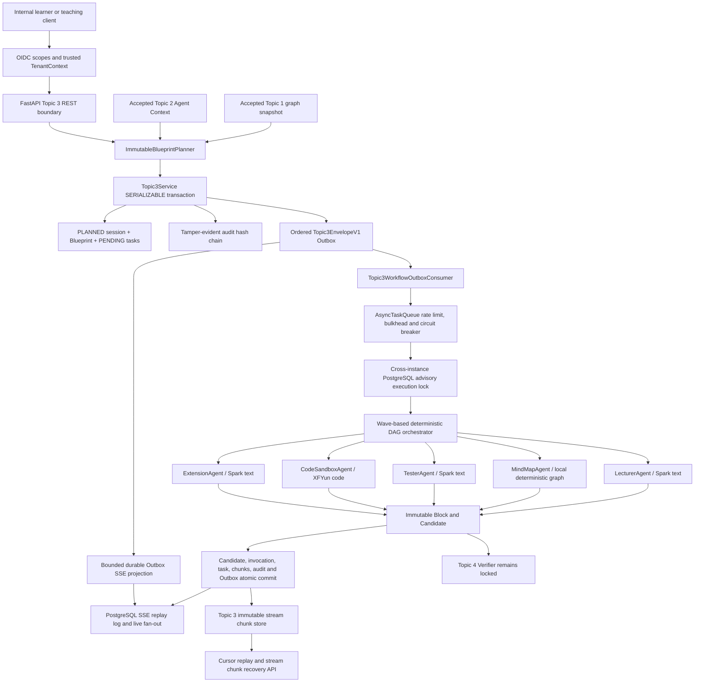
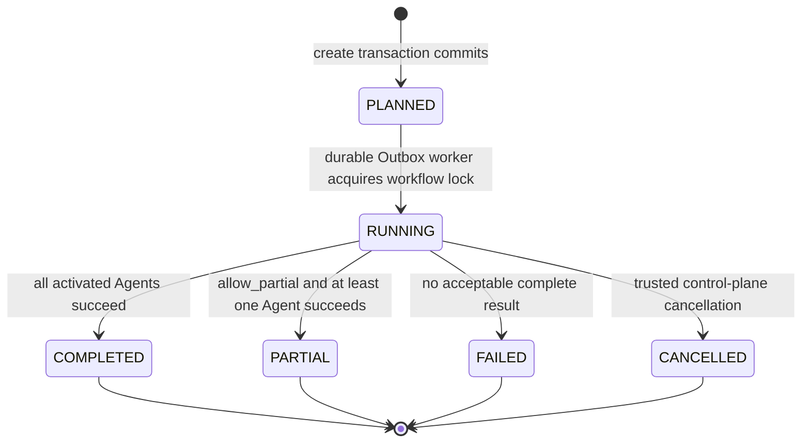

# Topic 3 五智能体生成集群与 SSE 协同运行时架构

## 1. 模块定位与冻结边界

Topic 3 是系统的个性化教学资源生成中枢。它只读取已冻结的 Topic 1 权威图谱快照与 Topic 2 `topic2.agent-context.v1`，生成不可变 Blueprint、Agent 任务快照、Candidate、Provider 调用证据和 staged SSE 分片。

Topic 3 不修改 Phase 1.1、Topic 1、Topic 2 的表或语义，不拥有最终学术发布权。`topic3.stream.chunk.staged` 仅供内部预览与后续核验；Topic 4 必须在远端验收解锁后增加 Verifier 和公开发布闸门。

## 2. 分层架构

## 3. 数据库与租户边界

| 表 | 作用 | 核心不变量 |
|---|---|---|
| `topic3_generation_sessions` | `PLANNED -> RUNNING -> terminal` 会话快照 | 逻辑会话版本唯一、父快照连续、绑定精确 Topic1/2 版本 |
| `topic3_execution_blueprints` | 不可变 DAG 与激活理由 | Blueprint hash、图谱 hash、画像摘要 hash 全绑定 |
| `topic3_agent_tasks` | Agent 状态转换快照 | PENDING/RUNNING/终态只追加，attempt 不超过预算 |
| `topic3_generated_candidates` | 标准化 Candidate 版本 | Candidate hash、Blueprint hash、个性化摘要一致 |
| `topic3_model_invocations` | 脱敏 Provider 调用证据 | 不保存 API key，保存请求/响应摘要、Token 和延迟 |
| `topic3_stream_chunks` | staged SSE UTF-8 分片 | fragment ID、块内顺序、数据 hash 与最终分片约束 |

六张表全部启用 `FORCE ROW LEVEL SECURITY`。运行角色仅有 `SELECT/INSERT`，数据库触发器阻断 `UPDATE/DELETE`。所有跨表关系携带 `tenant_id` 复合外键，无法构造跨租户 Blueprint、Candidate 或分片引用。

## 4. 工作流状态机

每次状态变化都创建新快照，不更新历史行。跨实例执行使用 PostgreSQL session-level advisory lock；进程退出会自动释放锁，Outbox 重试可从最新任务快照恢复。任务转换另有事务级 advisory lock，防止并发版本分叉。

## 5. Immutable Blueprint

Blueprint 由命令、Topic 1 图谱快照、Topic 2 个性化摘要确定性生成。相同输入产生相同 `blueprint_id`、task ID、依赖与 SHA-256。

固定顺序为 Lecturer、MindMap、Tester、CodeSandbox、Extension。MindMap 可独立从图谱生成；Tester、CodeSandbox、Extension 在同时启用 Lecturer 时依赖 Lecturer Candidate。`max_parallelism` 控制每一执行波，依赖满足后按 ordinal 稳定调度。

激活理由显式记录记忆风险、掌握缺口、工程目标和拓展目标，不允许 Agent 在运行时重新读取可变画像后自行改变策略。

## 6. 五大 Agent

### 6.1 LecturerAgent

使用 Spark 文本能力，严格输出 `topic3.lecturer-content.v1`。讲义包含目标、分层段落、总结、易错提醒和个性化说明。深度只接受 FOUNDATION、EXAM_FOCUS、POSTGRADUATE、ENGINEERING。

### 6.2 MindMapAgent

不调用外部模型。它从 Topic 1 DAG 和 Topic 2 掌握状态确定性生成 node/edge IR 与安全 Mermaid，仅允许 `graph TD`、节点和边，不生成 click 指令或外部链接。节点状态覆盖 PREREQUISITE、CURRENT、MASTERED、WEAK、FUTURE。

### 6.3 TesterAgent

使用 Spark 文本能力，输出概念、辨析、计算、工程应用和易错题。每题绑定目标知识点、难度、标准答案、步骤、分值和诊断标签。答题结果不在 Topic 3 内篡改画像，而是通过冻结 Topic 2 行为接口回流，再由 Topic 2 重建画像、记忆和路径。

### 6.4 CodeSandboxAgent

使用 XFYun code 能力生成 MATLAB、Simulink 逻辑说明和 Python 仿真文件。当前阶段只生成候选，不执行不可信代码。输出校验会拒绝进程启动、网络、文件系统和动态执行等危险模式；真正的隔离执行与学术结果核验由 Topic 4 C6 接管。

### 6.5 ExtensionAgent

使用 Spark 文本能力生成工程、论文要点、科研方向和行业应用候选。资源必须绑定目标知识点并提供 citation text；Topic 4 C7 才能确认来源、许可证和引用真实性。

## 7. Provider 与 Prompt 边界

Provider 注册表只允许 `spark_text`、`xfyun_code`、`seedance`。外部调用默认关闭；生产启用时必须同时开启 Outbox publisher、PostgreSQL SSE notification，并配置 Spark 与 XFYun code HTTPS endpoint。

所有文本/代码调用使用 `responses.lite.request.v1`，强制同时携带非空 `instructions` 与 `tools`，并以 Pydantic JSON Schema约束结构化输出。每个 Blueprint step 有独立超时，超时形成 `LIYAN-TIMEOUT` 可重试任务快照。

Provider 输入使用最小化教学投影。不会外发 learner ref、operation/session ID、画像/记忆/路径内部 UUID、审计 ID、created-by subject 或 source event ID。外部只接收六维分数、目标知识点记忆指标、路径决策、权威知识内容和教学目标。

## 8. 事务、恢复与 Outbox

创建工作流的同一 `SERIALIZABLE` 事务原子写入：会话、Blueprint、全部 PENDING 任务、审计事件、幂等结果和 `topic3.workflow.created` Outbox。

生产模式由 Outbox consumer 等待任务完成后确认消息。进程崩溃时，Outbox claim 与消息幂等租约可重试；跨实例 advisory lock 阻止重复 Provider 调用。每次 Agent 成功事务原子写入 Candidate、Provider 调用证据、SSE 分片、任务终态、审计与完成事件。

Outbox SSE bridge 只发布有界摘要。Candidate 大块正文和 chunk data 不复制到领域事件，完成事件只给出 Candidate 摘要、stream ID 和恢复端点，防止 256 KiB SSE 上限被大模型输出击穿。

## 9. SSE 与背压

- Agent 内容按 UTF-8 字节边界切片，默认每片不超过 16 KiB。
- fragment ID 由 Candidate、版本、Block 和 chunk index 确定性派生，客户端可幂等去重。
- 实时发布失败不会回滚已提交 Candidate；客户端从 durable chunk API 恢复。
- SSE replay cursor 使用租户绑定 HMAC，不能跨租户重放。
- Broker 对订阅者使用有界队列；慢消费者通过 PostgreSQL replay log 补齐间隙。
- Topic 3 事件为 `staged`，不得作为 Topic 4 最终发布授权替代物。

## 10. 权限与错误边界

| 能力 | Scope |
|---|---|
| 创建生成 | `topic3:generation:write` |
| 读取会话和历史 | `topic3:generation:read` |
| 恢复非终态工作流 | `topic3:generation:retry` |
| 读取 staged SSE/chunks | `topic3:sse:read` |
| 内部 Envelope 校验 | `topic3:validate` |
| 内部 SSE 发布 | `topic3:sse:publish` |

学习者读取历史时必须满足 `learner_ref == subject_ref`，跨学习者访问仅允许显式 `topic3:learner:any` 或 `topic3:admin`。租户、subject、scope 全部来自 OIDC 服务端上下文。

## 11. 验收指标

- 全项目 Python 覆盖率 `>=89%`，不得低于 Topic 2 的 `89.14%` 基线。
- 1000 个 Blueprint 构建 P95 `<25ms`；1000 个 Candidate 分片 P95 `<50ms`。
- 全量 Alembic upgrade/downgrade/upgrade 与 model drift 通过。
- PostgreSQL RLS、只追加触发器、幂等回放、跨实例锁和重启读取通过。
- Ruff、Go vet/race/build、TS/Vue typecheck/build 全绿。
- Trivy 全等级漏洞 0，Gitleaks 历史与工作树 0。

## 12. 竞赛差异化价值

1. 不是通用问答，而是 Topic 1 权威图谱与 Topic 2 六维画像双驱动的确定性多 Agent DAG。
2. Blueprint、Prompt、Provider、Candidate、SSE、审计和 Outbox 全部可版本回放。
3. Agent 失败可局部重试，依赖失败可解释跳过，允许受控 partial 结果。
4. 外部模型输入采用身份最小化投影，兼顾个性化与隐私边界。
5. staged 生成与 Topic 4 release authorization 分权，为学术防幻觉闭环保留不可绕过的发布闸门。
