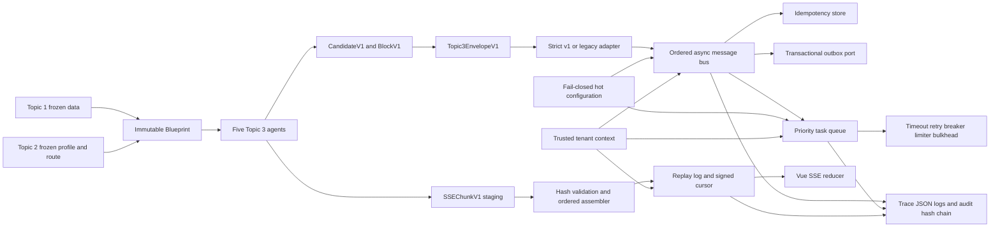

# Topic 3 Envelope and Engineering Infrastructure Freeze



## 1. Freeze Boundary

The shared wrapper is frozen at `topic3.envelope.v1`. Infrastructure may validate,
route, retry, audit, and adapt the wrapper, but it may not rewrite opaque agent
payload meaning. Lecturer, MindMap, Tester, CodeSandbox, and Extension retain
ownership of their versioned payload schemas.

Canonical sources and generated targets:

| Artifact | Role |
|---|---|
| `packages/contracts-python/src/liyans_contracts/envelope.py` | authoritative Envelope and error models |
| `packages/contracts-python/src/liyans_contracts/topic3.py` | authoritative Block, Candidate, and SSE chunk models |
| `packages/contracts-ts/src/generated/contracts.ts` | generated frontend TypeScript definitions |
| `packages/contracts-go/contracts/contracts.go` | generated Go interoperability definitions |
| `schemas/*.schema.json` | exact constraints for non-Python consumers |

Generation is one-way. Hand editing generated TypeScript, Go, or JSON Schema is
prohibited. `python tools/export_contracts.py` must reproduce all generated files.

## 2. Envelope Contract

### 2.1 Envelope header

| Field | Type and constraint | Authoritative source | Rule |
|---|---|---|---|
| `schema_version` | literal `topic3.envelope.v1` | contract package | immutable wire major |
| `envelope_id` | UUID | producing infrastructure | globally unique message identity |
| `event_type` | 1-128 lowercase catalog name | owning producer | no ad hoc display text |
| `message_kind` | command/event/result/error | owning producer | error requires an error receipt |
| `tenant_id` | 1-128 string | authenticated server context | never accepted from untrusted identity claims |
| `session_id` | UUID | frozen Topic 1/2 session | learning workflow scope |
| `subject_ref` | 1-256 opaque string | privacy/tokenization layer | raw PII prohibited |
| `correlation_id` | UUID | workflow origin | stable across the agent chain |
| `causation_id` | optional UUID | message dispatcher | immediate parent Envelope |
| `sequence` | integer, zero or greater | partition producer | contiguous commit order per partition |
| `partition_key` | 1-256 string | deterministic router | normally tenant/session/candidate |
| `producer` | `ProducerMetadataV1` | deployment runtime | immutable build provenance |
| `delivery` | `DeliveryMetadataV1` | dispatch policy | at-least-once, bounded attempts |
| `resource` | optional `ResourceMetadataV1` | generation orchestrator | exact blueprint/candidate/block versions |
| `trace_id` | 16-64 hex | trusted ingress or runtime | observability only, not authorization |
| `span_id` | optional 8-32 hex | tracing runtime | current operation span |
| `created_at` | aware UTC datetime | producing service clock | no naive timestamps |
| `error` | optional `ErrorReceiptV1` | failing component | present only for error messages |
| `payload` | object | owning agent schema | opaque to generic infrastructure |

### 2.2 Producer metadata

| Field | Constraint | Source |
|---|---|---|
| `agent` | one of five agents or null for platform events | orchestrator/runtime |
| `service` | 1-128 stable name | deployment manifest |
| `instance_id` | 1-128 ephemeral identity | process runtime |
| `build_version` | strict version string | immutable image/build metadata |

### 2.3 Delivery metadata

| Field | Constraint | Source and behavior |
|---|---|---|
| `mode` | `AT_LEAST_ONCE` | fixed platform guarantee |
| `idempotency_key` | 16-160 safe characters | originator; cannot be reused for different meaning |
| `attempt` | 1-16 | dispatcher; excluded from semantic delivery digest |
| `max_attempts` | 1-16 | route policy; attempt cannot exceed it |
| `priority` | critical/high/normal/low | deterministic route policy |
| `available_at` | aware UTC | dispatcher; cannot predate message creation |
| `expires_at` | optional aware UTC | originator/policy; expired work is rejected |

### 2.4 Resource metadata

`blueprint_id` and `blueprint_version` bind generation to the exact immutable
blueprint. Candidate identity and version are an all-or-none pair. `block_id`
never implies a mutable latest version. The resource type is checked against the
owning agent matrix.

### 2.5 Error receipt

Error codes are stable uppercase catalog identifiers. The safe message is
redacted and capped at 512 characters. `details_ref` contains only restricted
diagnostic references or non-sensitive structured values. Provider secrets,
raw prompts, PII, and stack traces are prohibited.

## 3. Block and Candidate Contracts

### 3.1 BlockV1

| Field group | Rule |
|---|---|
| identity | `block_id` is candidate-local and unique |
| ordering | `ordinal` is zero-based; Candidate ordinals are contiguous |
| content | object remains owned by `content_schema_version` |
| integrity | `content_sha256` covers canonical content only |
| dependencies | IDs are unique, candidate-local, and cannot reference self |
| lifecycle | complete, failed, or superseded; wrapper mutation is prohibited |

### 3.2 CandidateV1

Candidate version one has no parent. Every later version points exactly to the
previous integer version. Block IDs are unique; dependencies resolve inside the
same candidate. Resource type must be owned by the provenance agent. Provider
alias is restricted to Spark text, XFYun code, SeeDance, or deterministic local
processing. Candidate hash covers the canonical candidate excluding its own hash.

## 4. SSE Contract and Flow

`SSEChunkV1` binds every fragment to a stream, exact candidate version, and
optional block. `data_sha256` is recomputed over exact UTF-8 bytes. START is only
valid at index zero, END is final, and a final fragment is END or SNAPSHOT.

Runtime rules:

1. Text is split on Unicode character boundaries and never in the middle of UTF-8.
2. A single fragment is a final SNAPSHOT; a multi-fragment stream is START,
   zero or more DELTA fragments, then END.
3. Duplicate fragment IDs or indexes with the same digest are ignored.
4. Reuse with a different digest is a hard conflict.
5. Gaps are held in a bounded buffer; content is exposed only after contiguous assembly.
6. The replay cursor is HMAC signed and tenant-bound.
7. Slow subscribers are disconnected when their bounded queue fills and resume
   from the replay log using `Last-Event-ID`.
8. Heartbeats use SSE comment frames and do not advance the replay sequence.

The current replay store is an executable in-memory development adapter. The
production adapter must use the durable public event log required by ADR-0006.

## 5. Compatibility Policy

`Topic3EnvelopeAdapter` accepts strict v1 directly and maps legacy v0 only through
an explicit field table. Missing tenant, session, subject, or timestamp is fatal.
Legacy user IDs are one-way hashed into opaque subject references. Unknown agent
or resource values fail closed. Legacy error codes are normalized to the shared
catalog character set.

Cross-agent payload conversion is disabled by default. Every allowed conversion
requires registration by `(source agent, target agent, payload schema version)`.
No structural guessing, field dropping, or automatic semantic conversion is
permitted. A breaking wrapper change creates v2; v1 remains readable.

## 6. Message Bus

### Interface

- Input: validated `Topic3EnvelopeV1`.
- Output: processed, buffered, or duplicate dispatch result.
- Handler: async callable registered by exact `event_type`.
- Extension: ordered middleware chain and async failure callback.

### Ordering and idempotency

Sequence begins at zero per partition. A higher sequence is buffered. A lower
sequence is stale unless its idempotency record proves it is the same completed
delivery. The partition cursor advances only after every registered handler and
middleware completes. Handler failure removes the processing reservation so an
at-least-once redelivery can retry the same semantic message.

The semantic digest normalizes retry-mutated `attempt` and `available_at`; payload,
resource binding, producer provenance, expiry, and routing identity remain covered.
A duplicate key with a different digest returns
`LIYAN-MESSAGE-DUPLICATE-CONFLICT`.

Production persistence uses a unique PostgreSQL idempotency record and the
`OutboxRepository` port. Business state, audit evidence, and outbox append must
commit in one database transaction.

## 7. Async Task Queue and Resilience

The executable queue provides deterministic priority plus FIFO order inside the
same priority. Each task declares type, tenant, payload, deadline, maximum attempts,
and optional correlation identity. Registered handlers are wrapped by:

1. per-tenant token bucket;
2. global async bulkhead;
3. per-task-type circuit breaker;
4. operation timeout;
5. bounded exponential retry with jitter;
6. final compensation and dead-letter result.

Only errors explicitly marked retriable are retried. Unknown handlers, invalid
contracts, and generic code failures fail immediately. Production workers must
claim durable outbox/task rows with leases; the in-memory queue is for local
execution and deterministic tests.

## 8. Tenant, Configuration, and Provider Boundaries

Internal APIs require trusted gateway headers for tenant and opaque subject.
The middleware places tenant, role, scope, session, and trace data in contextvars.
Repositories and handlers call `assert_tenant` before accessing tenant-owned data.
Direct public exposure of trusted-header endpoints is prohibited; authentication
and signed gateway claims are the next engineering stage.

Provider policy is TOML, fail-closed, and hot reloaded. A candidate document is
parsed and validated before it replaces the active snapshot. Invalid changes keep
the last known-good policy and emit an audit event. Non-allowlisted or prohibited
providers cannot be enabled. External embedding remains prohibited.

## 9. Observability and Audit

Structured logs are JSON and carry trace, span, Envelope, and tenant correlation.
They never use trace identity as authorization. The audit store builds an
independent hash chain per tenant with contiguous sequence, previous hash, event
hash, UTC time, actor, action, outcome, and redacted metadata.

Critical audit writes fail closed. The JSONL development store validates the full
chain at startup and uses flush plus fsync before acknowledging append. Production
uses the PostgreSQL audit repository and retention controls defined by C10/C11.

## 10. Unified Error Handling

FastAPI returns `ErrorReceiptV1` for contract, tenant, messaging, task, timeout,
rate, circuit, provider, audit, configuration, and internal failures. Responses
contain a safe message and trace ID but no raw exception. Validation failures are
HTTP 422, tenant violations 403, conflicts 409, limits 429, unavailable components
503, and operation timeouts 504.

## 11. Source Layout

```text
backend/src/liyans/
  api/                         middleware, errors, health, Topic 3 internal routes
  core/                        settings, tenant context, hashing, provider policy
  domains/generation/          legacy and cross-agent compatibility adapters
  infrastructure/
    messaging/                 bus, middleware, idempotency
    observability/             context, JSON logging, audit chain
    persistence/               transactional outbox port
    streaming/                 chunking, assembly, replay, broker
    tasks/                     priority workers and compensation
    resilience.py              retry, timeout, breaker, limiter, bulkhead
packages/
  contracts-python/            canonical Pydantic contracts
  contracts-ts/                generated TypeScript contracts
  contracts-go/                generated Go contracts
schemas/                       generated JSON Schema catalog
infra/                         local PostgreSQL, backend image, SSE proxy baseline
```

## 12. Deployment Baseline

- Python 3.11 only for the backend runtime.
- PostgreSQL 16 for authoritative state, idempotency, outbox, and audit.
- One API process per container; worker process count is deployment-configured.
- Reverse proxy buffering is disabled for SSE and idle timeout exceeds heartbeat.
- Cursor secrets, provider credentials, and database credentials come from a
  secret manager, never repository configuration.
- Production images and dependencies must be digest/lock pinned and represented
  in the C11 SBOM before release.

## 13. Quantitative Acceptance Targets

| Capability | Target |
|---|---|
| Envelope validation p95 | <= 5 ms excluding network |
| in-process ordered dispatch p95 | <= 10 ms excluding handler time |
| duplicate lookup p95 | <= 5 ms on PostgreSQL adapter |
| SSE fragment size | <= 16 KiB default, <= 64 KiB contract maximum |
| first SSE progress event p95 | <= 800 ms after accepted generation request |
| replay recovery | no missing or reordered event inside retention window |
| concurrent SSE connections | 2,000 per acceptance environment |
| concurrent verification workflows | 100 sustained |
| tenant leakage tests | zero accepted cross-tenant reads/writes |
| audit chain verification | 100% after restart and recovery tests |
| invalid Provider policy activation | zero; last-good snapshot retained |

Unit tests exercise contract rejection, legacy mapping, cross-agent denial,
partition gaps, duplicate conflicts, failed-handler retry, UTF-8 assembly,
tenant-bound cursor replay, priority/retry/compensation, audit tamper detection,
hot-config rollback, circuit recovery, and API error receipts.

## 14. Failure and Operations Playbook

| Failure | Required response |
|---|---|
| PostgreSQL unavailable | stop authoritative commits and publication; keep readiness false |
| outbox publisher crash | lease expires, another worker reclaims, consumer deduplicates |
| sequence gap | buffer within bound, alert on age, request replay, never skip automatically |
| idempotency conflict | quarantine message and audit; no automatic rewrite |
| slow SSE client | disconnect, preserve durable log, resume with signed cursor |
| invalid config reload | retain active snapshot, audit rejection, require corrected file version |
| audit write failure | deny critical state transition and surface 503 |
| task downstream failure | retry eligible errors, open circuit, compensate, dead-letter |
| provider uncertainty | remain disabled; deterministic local capability continues |

## 15. Competition-Level Engineering Differentiators

- A versioned immutable educational resource wrapper shared by five heterogeneous agents.
- Claim-ready provenance from blueprint through candidate, block, provider request,
  trace, idempotency, and audit evidence.
- Deterministic at-least-once semantics with explicit gap handling instead of
  relying on best-effort async ordering.
- UTF-8-safe staged SSE plus tenant-bound cryptographic resume cursors.
- Fail-closed provider and configuration controls aligned with the allowed API set.
- Hash-chain audit and exact version binding that directly support the later C1
  Verifier release gate and Self-Correction revision loop.

## 16. Next Engineering Sequence

1. Implement PostgreSQL sessions, tenant-scoped repositories, idempotency, outbox,
   durable SSE event log, and audit adapters with migrations.
2. Implement authenticated identity and authorization middleware; remove direct
   trust in client-supplied internal headers.
3. Lock Python and Node dependencies, generate SBOMs, and add CI release gates.
4. Build approved Spark text, XFYun code, and SeeDance adapters; keep disabled until
   official endpoint, credential, quota, and contract smoke evidence passes.
5. Bind frozen Topic 1/2 repositories and then implement the five Topic 3 agents.
6. Connect Topic 3 staged candidates to C1 Verifier and the release-authorized SSE path.
