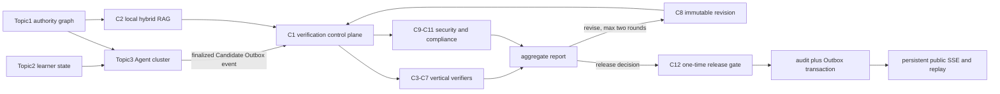

# Topic4 Trusted Verification and Publication Architecture

## 1. Position in CyberControl

Topic4 is the final trusted backend boundary between Topic3-generated teaching
Candidates and public delivery. It combines deterministic Claim extraction,
local authoritative retrieval, vertical academic verification, cross-cutting
security checks, bounded self-correction, and one-time atomic publication.

## 2. Application Runtime

`backend/src/liyans/main.py` assembles the Topic4 runtime without changing
frozen Phase1.1 or Topic1-Topic3 interfaces:

1. `VerificationService` and `VerificationStateMachine` own C1 state.
2. `KnowledgeRetrievalService` and `HotReloadableRAGIndex` own C2 retrieval.
3. The C3-C11 handler registry is passed to `BoundedModuleExecutor`.
4. `RevisionEngine` owns C8 immutable Candidate version creation.
5. `C12ReleaseService` and `PostgresAtomicReleaseRepository` own publication.
6. `Topic3CandidateVerificationConsumer` converts finalized Topic3 events into
   Topic4 tasks.
7. `Topic4PublicationSSEConsumer` projects committed publication Outbox events
   into the persistent SSE broker.

## 3. API Surface

The 19 `/internal/topic4` routes provide:

- health and readiness;
- verification create, queue, batch, snapshot, Claim, report, and TraceID
  queries;
- local RAG retrieval and evidence queries;
- C8 revision creation and history;
- C12 authorization validation, issue, single/batch publication, and history;
- persistent SSE replay and live streaming.

Every route requires an OIDC scope and obtains tenant identity from trusted
middleware. API payloads are wrapped in the frozen Envelope contract.

## 4. Persistence Architecture

Migrations `20260716_0007`, `20260716_0008`, and `20260716_0009` add 41 Topic4
tables across control, knowledge, revision, security, privacy, compliance,
acceptance, and release domains. Every table is tenant scoped, FORCE RLS
protected, and covered by append-only mutation rejection where required.

PostgreSQL stores authoritative state and immutable metadata. The filesystem
object store stores content-addressed Candidate, evidence, result, report,
index, and public artifacts. Database rows bind object keys, byte sizes, and
SHA256 values.

## 5. Transaction and Recovery Model

- C1, C2 lifecycle, C8, and C12 mutations use the existing asynchronous
  PostgreSQL transaction manager.
- Critical mutations use SERIALIZABLE isolation and bounded retry.
- Advisory transaction locks serialize audit predecessors, authorization
  consumption, and per-Candidate revision.
- Idempotency records reject duplicate or changed replays.
- Outbox rows commit with domain state; consumers deduplicate delivery.
- Persistent SSE supports cursor replay after disconnect.
- Faiss and BM25 indexes restore from immutable local corpus artifacts and
  recover through CAS activation.

## 6. Security Model

- No external embedding or web retrieval is used by Topic4.
- Tenant identity is never accepted from request payloads or headers.
- C9 detects injection, credential, malware, exfiltration, and tenant-reference
  attacks.
- C10 detects and tokenizes or redacts PII without retaining raw sensitive
  content in result artifacts.
- C11 validates trusted SBOM, vulnerability, license, and reproducible
  provenance evidence; missing trusted packages fail closed.
- C12 binds authorization, Candidate, report, allowed blocks, request, and
  artifacts before publication.

## 7. Freeze and Extension Boundary

Topic4 is accepted on its development branch. Protected-main integration is
still controlled by PR checks and CODEOWNERS. Future frontend code is limited to
API consumption, visualization, and SSE rendering and cannot alter backend
trust semantics.
