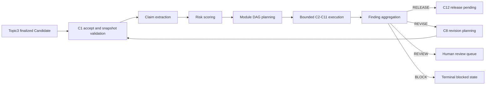

# Topic4 C1 Verification Control Plane Architecture

## 1. Scope

C1 is the deterministic control plane for every Topic4 verification run. It
accepts an immutable Topic3 Candidate snapshot, extracts auditable Claims,
assigns risk, builds a dependency-safe module dispatch plan, aggregates module
findings, and routes the result to release, bounded revision, or human review.

C1 does not change Phase1.1 or Topic1-Topic3 contracts. It composes the frozen
database session, tenant context, audit hash chain, Outbox, artifact store, and
task queue through existing public interfaces.

## 2. Runtime Components

- `VerificationService`: SERIALIZABLE mutation boundary, idempotency, audit,
  Outbox, state transitions, Claim persistence, aggregation, and reports.
- `VerificationStateMachine`: explicit allowed transitions and a hard two-round
  revision budget.
- `ClaimExtractor`: deterministic extraction from immutable Candidate blocks.
- `RiskScorer`: risk classification and mandatory cross-cutting module policy.
- `DispatchPlanner`: acyclic C2-C11 module dependency plan.
- `BoundedModuleExecutor`: bounded concurrency, timeout, retry, and dependency
  failure propagation.
- `VerificationReportBuilder`: immutable report artifact and SHA binding.
- `Topic4Runtime`: application composition, queue execution, snapshot queries,
  C8 re-entry, and C12 hand-off.

## 3. Control Flow

## 4. State and Recovery Model

The persisted state sequence is:

`ACCEPTED -> SNAPSHOT_VALIDATING -> CLAIM_EXTRACTING -> CLAIMS_READY ->
MODULE_DISPATCHING -> VERIFYING -> AGGREGATING`.

Aggregation can route to `RELEASE_PENDING`, `REVISION_PLANNING`,
`REVIEW_REQUIRED`, or `BLOCKED`. Revision follows
`REVISION_PLANNING -> REVISION_WAITING -> REVERIFYING -> SNAPSHOT_VALIDATING`.
Terminal states reject further transitions.

Every mutation is idempotency-keyed. A retry reads the persisted immutable
state and either returns the previous result or resumes from the next legal
transition. Per-tenant advisory locks serialize audit-chain predecessor reads,
and bounded process-local lock stripes reduce avoidable SERIALIZABLE conflicts.

## 5. Security and Consistency Boundaries

- Tenant identity comes only from the authenticated `TenantContext`.
- Every repository query includes the trusted tenant and is also protected by
  PostgreSQL FORCE RLS.
- Candidate, Claim, finding, report, and evidence records carry TraceID,
  version CAS, canonical SHA256, and immutable markers.
- Audit and Outbox records are appended in the same transaction as control
  plane state.
- Missing evidence, missing module results, invalid transitions, expired
  deadlines, and integrity mismatches fail closed.

## 6. Operational Surface

C1 is exposed through the Topic4 REST routes for task creation, execution,
snapshot queries, Claim queries, report queries, and TraceID queries. The same
runtime handler is registered with the existing `AsyncTaskQueue` for durable
Topic3-to-Topic4 execution.
