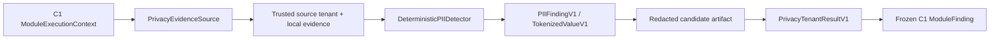

# Topic4 C10 Privacy and Tenant Boundary Architecture

## Scope

C10 is the privacy gate for Topic3 Candidate content. It performs deterministic
local detection of names, email addresses, phone numbers, national IDs,
student IDs, addresses, biometric fields, and credential fields. It produces
immutable PII findings, deterministic non-reversible tokens for configured
low-risk identifiers, and a redacted Candidate artifact. No raw PII is written
to a result artifact.

## Layering

The source must return `source_tenant_id` equal to the trusted Claim tenant.
This is a second boundary proof in addition to the C1 dispatch tenant and the
tenant-bound evidence records. A missing or mismatched source tenant fails
closed before scanning.

## Privacy actions

| PII class | Action | Verdict effect |
| --- | --- | --- |
| National ID, biometric, credential | BLOCK | `UNSAFE`, non-waivable |
| Email, phone, student ID | TOKENIZE | `PARTIALLY_SUPPORTED` with redacted artifact |
| Name, address | REDACT | `PARTIALLY_SUPPORTED` with redacted artifact |
| No PII | none | `SUPPORTED` when local evidence exists |

Tokens are deterministic SHA-derived identifiers with a versioned vault
reference. The C10 runtime does not retain the source value and marks tokens
non-reversible; any future reversible vault integration must be a separately
approved extension behind the same tenant and key-version boundary.

## Immutability and failure handling

- PII findings, tokens, and privacy results are append-only contract records.
- The redacted artifact contains block metadata and transformed content only;
  it includes the original Candidate SHA for binding but never the original
  text.
- Candidate ID, version, and SHA are validated before detection.
- Evidence records require exact tenant, Claim, Trace, record SHA, and excerpt
  SHA matches.
- Detection limits bound both string length and match count.
- C1 retains transaction, audit, Outbox, and persistence ownership.
