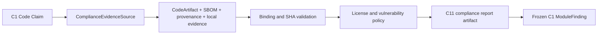

# Topic4 C11 Supply-Chain Compliance Architecture

## Scope

C11 verifies code Claims against tenant-bound local CycloneDX SBOM evidence,
component licenses, vulnerability records, and reproducible build provenance.
The runtime never queries an external vulnerability service, package registry,
license database, or public URL. External scan output must be imported as an
immutable local evidence snapshot before C11 can use it.

## Layering

Non-code Claims are `NOT_APPLICABLE`; code Claims require a trusted source
tenant, valid CodeArtifact, CycloneDX manifest and canonical document hash,
complete component records, reproducible provenance, and at least one local
evidence reference.

## Policy

- Allowed license identifiers are limited to the repository's approved
  commercial-compatible set: MIT, BSD, Apache-2.0, ISC, MPL-2.0, PSF-2.0,
  Unicode-3.0, Zlib, and 0BSD.
- GPL/AGPL, SSPL, BUSL, Commons Clause, and Elastic License findings are
  critical non-waivable blocks.
- Missing, unknown, or unapproved license evidence is unsafe.
- Open HIGH or CRITICAL vulnerabilities are unsafe; non-waivable accepted-risk
  records are rejected.
- Every declared CodeArtifact dependency must be represented in the SBOM.
- Build provenance must bind CodeArtifact, SBOM, source SHA, output SHA, and a
  versioned sandbox policy, and must declare reproducibility.

## Recovery and immutability

- All records are validated as immutable Topic4 records before use.
- Duplicate component, vulnerability, evidence, or tenant identities fail
  closed.
- Bounded evidence and component limits prevent oversized local snapshots from
  exhausting the verifier.
- C1 retains transaction, audit, Outbox, retry, and persistence ownership; C11
  returns only a frozen `ModuleFinding` and immutable result artifact.
