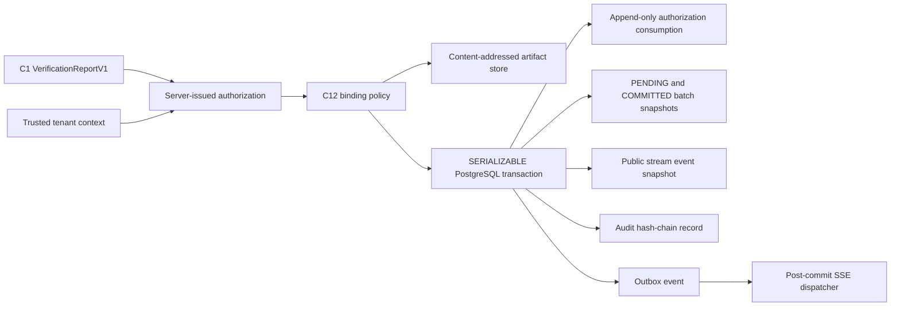

# Topic4 C12 Atomic Publication Gate Architecture

## 1. Scope

C12 is the only public publication boundary for Topic4 verified Candidate
resources. It consumes a server-issued, one-time `release.authorization.v1`
record and publishes only the blocks authorized by that immutable record.
Frontend development remains locked until the implementation and archive
commits pass remote PostgreSQL and release-quality gates.

## 2. Trust Boundary

The artifact store is written before the database transaction because the
database stores immutable object references rather than large payloads. A
store failure or metadata mismatch fails closed. If the database transaction
fails after object creation, the unreferenced content-addressed objects remain
eligible for a tenant-scoped garbage-collection job; no public database row,
Outbox event, or SSE event is committed.

## 3. Binding Rules

- The trusted tenant context must equal the authorization, report, and
  Candidate tenant.
- Authorization, report, publication batch, and public stream records must
  pass the canonical Topic4 record SHA-256 check.
- Candidate content is re-hashed from the canonical Candidate document.
- The report artifact SHA must equal `report_sha256`.
- Authorization IDs, Candidate version/SHA, report ID/SHA, verification ID,
  release mode, and the complete allowed block set are compared against the
  issued database row.
- `FULL` requires every Candidate block and no disclosure code.
- `FULL_WITH_DISCLOSURE` requires at least one disclosure code and can expose
  only the explicitly authorized block IDs.
- The request document is canonical and its SHA is bound to the deterministic
  publication batch ID.

## 4. Transaction Semantics

`PostgresAtomicReleaseRepository.consume_and_publish` executes through the
existing `DatabaseSessionManager` at `SERIALIZABLE` isolation with bounded
serialization retries. The transaction appends, in one commit boundary:

1. the PENDING batch snapshot;
2. the one-time authorization consumption row;
3. the COMMITTED batch snapshot;
4. the public stream event row;
5. the audit hash-chain record; and
6. the Outbox event that causes post-commit SSE delivery.

The public event references the COMMITTED batch version, so the committed
batch is flushed before the event row. No external SSE side effect is executed
inside the database transaction.

## 5. Replay and Recovery

- Same authorization plus same request SHA returns the previously committed
  batch/event result after validating both stored contracts and their hashes.
- Same authorization plus a different request SHA is rejected as replay.
- A changed authorization payload is rejected against the append-only issued
  authorization row before replay lookup.
- An unconsumed expired authorization is rejected.
- A previously committed publication may be replayed idempotently after expiry;
  expiry cannot invalidate an already committed result.
- Missing, malformed, empty, or hash-inconsistent batch/event snapshots fail
  closed and are never re-published.

## 6. Compatibility Boundary

The implementation is additive under
`backend/src/liyans/domains/release`. It reuses the frozen Topic4 C1
contracts, existing tenant context, audit service, Outbox repository, database
transaction manager, and artifact object store. No Phase1.1, Topic1, Topic2,
Topic3, C1-C11 contract, migration, frontend, or CI policy is modified.
