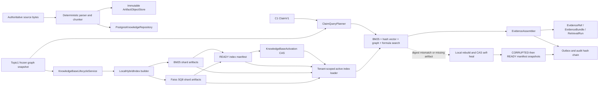

# Topic4 C2 Local Hybrid RAG Architecture

## 1. Scope

C2 is the local-first authoritative retrieval runtime used by the Verifier. It
accepts a frozen Topic1 graph and immutable Topic4 source versions, then emits
reproducible query plans, ranked evidence, and append-only retrieval records.

The implementation does not call external embedding services, external search
engines, or the public Internet. The only vector representation is the signed,
deterministic 2048-dimensional lexical hash defined by ADR-0005.

## 2. Runtime Topology

## 3. Layer Responsibilities

| Layer | Implementation | Non-negotiable invariant |
|---|---|---|
| Ingestion | `ingestion.py` | parser output, formula signatures, and chunk IDs are deterministic |
| Artifact staging | `artifact_writer.py` | object keys are tenant scoped and immutable; same key requires same SHA |
| Persistence | `postgres_repository.py` | all reads carry tenant predicates and all writes require a transaction |
| Transaction control | `transactions.py` | SERIALIZABLE, idempotency reservation, audit append, and Outbox are atomic |
| Lifecycle | `lifecycle.py` | graph/source CAS is checked before activation; BUILDING and READY are append-only |
| Retrieval core | `retrieval.py` | 2048 dimensions, deterministic tokenizer/hash, bounded shards, deterministic tie breaks |
| Retrieval service | `retrieval_service.py` | active-version validation, evidence persistence, replay, and self-healing |

## 4. Retrieval Pipeline

1. Verify that `ClaimV1.tenant_id` equals the trusted tenant context.
2. Resolve the database activation for `(tenant_id, course_id)`.
3. Load the immutable Topic1 graph, source-version bundles, chunks, and READY
   manifest under the same tenant.
4. Restore each BM25 and Faiss shard by SHA. A missing or corrupt artifact is
   rebuilt only from the immutable chunk corpus.
5. Build a deterministic query plan containing lexical, graph, and formula
   channels.
6. Execute BM25, signed hash vector search, Topic1 graph expansion, and formula
   signature matching. Results are fused with deterministic reciprocal rank
   fusion and authority-tier tie breaking.
7. Persist the query plan, evidence references, evidence bundle, retrieval run,
   audit event, and Outbox event in one SERIALIZABLE transaction.
8. A changed activation causes a conflict instead of persisting evidence from a
   stale knowledge-base version.

BM25 applies a bounded high-frequency-term policy. Terms present in more than
20 percent of a shard are skipped when a selective term is available; otherwise
the rarest available term is used as a deterministic fallback. This preserves
the useful ranking signal while preventing common educational boilerplate from
creating an unbounded scan.

## 5. Self-Healing Protocol

The loader treats artifact SHA, payload schema, index dimension, metric type,
document count, shard ordinal, and corpus coverage as integrity checks. On a
failure:

1. Restore unaffected shards and rebuild only affected shards where possible.
2. Stage replacement artifacts under a new deterministic recovery key.
3. Acquire the manifest advisory lock and compare the old manifest SHA.
4. Append a `CORRUPTED` manifest snapshot followed by a `READY` snapshot in the
   same transaction as audit and Outbox records.
5. If another process wins the CAS, wait for and consume the persisted READY
   manifest rather than returning a locally constructed, non-persisted result.
6. Keep the old artifacts and snapshots for forensic replay; never overwrite
   evidence or a verified artifact.

## 6. Tenant and Transaction Boundaries

- Object storage partitions by a SHA-derived tenant directory.
- Every repository query includes the tenant predicate and is additionally
  protected by PostgreSQL RLS.
- A source, graph snapshot, knowledge-base version, chunk, manifest, evidence
  record, audit event, and Outbox message must belong to the current tenant.
- Activation changes use an advisory lock plus an expected activation version.
- Retrieval idempotency keys are bound to the operation and canonical request
  digest; reusing a key for different content returns a conflict.
- Evidence records are append-only and reference immutable source artifacts and
  chunk SHA values.

## 7. Resource Controls

- Source import is bounded by the frozen ingestion limits.
- Chunk size and overlap are configured by `KnowledgeRuntimeConfig`.
- Faiss and BM25 artifacts are sharded at 10,000 records by default.
- CPU-heavy index construction runs in a worker thread and does not block the
  asyncio event loop.
- Search execution runs in a worker thread behind a deadline.
- Index restoration is serialized per tenant/course in-process and protected by
  database advisory locks across processes.

## 8. Known Scope Boundary

C2 is a checkpoint, not the Topic4 final release. C3-C7 professional verifiers,
C8 revision, C9-C11 security/compliance verifiers, C12 release authorization,
Topic4 API routing, queue consumers, and public SSE wiring remain locked for the
following phases.
