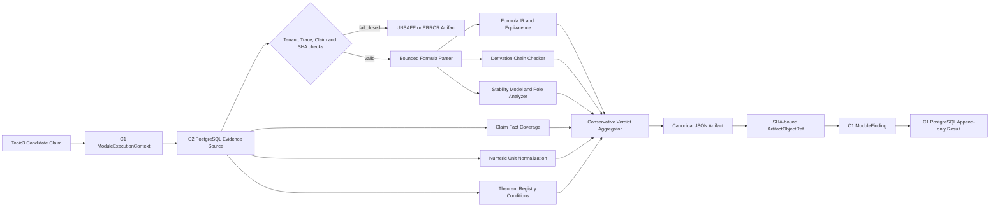

# C3 Academic Verification Runtime

## Scope

C3 is the deterministic academic verification module for formula, theorem, numerical,
stability, derivation, and claim-level fact assertions. It consumes immutable Claim and
C2 EvidenceRef records and returns the frozen C1 `ModuleFinding` shape. No external
embedding, web search, or unapproved model provider is used.

## Runtime Flow

## Deterministic Invariants

1. Every input evidence record must match the Claim tenant, verification ID, claim ID,
   trace ID, record hash, and excerpt hash.
2. Formula parsing is bounded by expression size, symbol count, operation count,
   nesting depth, and exponent magnitude. SymPy receives an empty built-in namespace
   and an allow-listed local dictionary.
3. Symbolic equivalence is preferred. Numeric sampling can disprove an assertion but
   cannot promote an equation to supported when its zero set was not symbolically
   established.
4. Continuous stability is classified by pole location and Routh-Hurwitz first column;
   discrete stability uses unit-circle classification and Jury-compatible root checks;
   state-space stability uses eigenvalues.
5. Evidence is loaded from the latest immutable C2 EvidenceBundle only. Historical
   evidence rows not referenced by that bundle are excluded from the verification.
6. Every result is canonical JSON, content-addressed by SHA256, and stored under a
   tenant-partitioned immutable object key before C1 persists the result record.

## Public Components

| Component | Responsibility |
| --- | --- |
| `SafeFormulaParser` | Bounded normalization, extraction, parsing and canonicalization |
| `FormulaEquivalenceEngine` | Symbolic, counterexample and conservative numeric comparison |
| `DerivationChecker` | Consecutive derivation-step validation |
| `StabilityModelBuilder` / `StabilityAnalyzer` | Hash-bound model creation and pole/criterion analysis |
| `TheoremRegistry` / `TheoremVerifier` | Versioned theorem conditions and evidence-bound verdicts |
| `NumericFactVerifier` | Units, tolerances, inequalities and numeric conflicts |
| `ClaimFactVerifier` | Authority-weighted claim/evidence coverage and conflict detection |
| `PostgresAcademicEvidenceSource` | C2 bundle-scoped PostgreSQL evidence adapter |
| `C3AcademicHandler` | C1 executor-compatible orchestration and Artifact output |

## Failure Policy

Parser policy violations, cross-tenant evidence, hash mismatch, malformed stability
models, and missing immutable evidence are never silently accepted. The handler emits
an immutable diagnostic artifact and returns `UNSAFE`, `ERROR`, or
`INSUFFICIENT_EVIDENCE` according to the failure class. Only authoritative evidence
can support a positive finding.

## Deployment Contract

`numpy` and `sympy` are locked as backend runtime dependencies because C3 is loaded by
the production verifier worker. The C2 `faiss-cpu` extra remains independently
selectable. The handler must be registered under `VerificationModule.C3_ACADEMIC` in
the existing `BoundedModuleExecutor`; C1 persistence and Outbox publication remain
the sole transaction owner.

## Non-goals

C3 does not mutate claims, evidence, Topic1 knowledge, Topic2 state, or C1/C2 records.
Revision, security/privacy/compliance modules, release authorization, and frontend
integration remain locked to their prescribed later stages.
