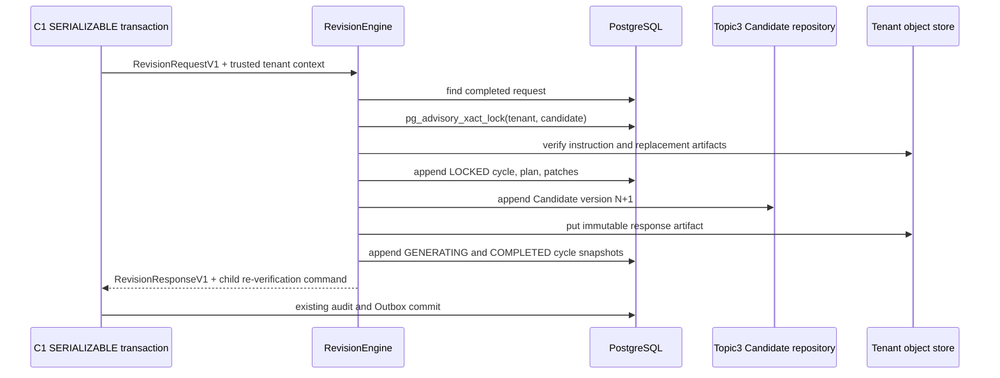

# C8 Immutable Revision Architecture

## Scope

C8 is the bounded self-correction boundary between the frozen C1 verifier and
the frozen Topic3 Candidate store. It accepts a C1 `RevisionRequestV1`, applies
only deterministic, claim-bound patches, appends a new Candidate version, and
returns a child re-verification command. It does not publish content, emit
Outbox messages, or commit a transaction; those responsibilities remain with
the frozen C1 service boundary.

## Invariants

- A request is accepted only when tenant context, Candidate ID, version, and
  Candidate SHA-256 all match.
- `revision_round` must equal the Candidate version being revised and is
  limited to one or two.
- One PostgreSQL transaction-scoped advisory lock serializes revisions for a
  Candidate. The lock is released automatically on commit or rollback.
- Replacement artifacts are read through the tenant-partitioned immutable
  object store. The object SHA, byte length, Topic3 `BlockV1` contract, content
  schema, block identity, dependency list, and replacement content SHA are all
  checked before persistence.
- Removal is restricted to `FAILED` or `SUPERSEDED` terminal blocks and is
  rejected when another block depends on the removed block.
- Historical Candidate, cycle, plan, patch, evidence, and report rows are
  never updated or deleted. The revised Candidate retains its logical ID,
  increments its version, and records the previous version.
- The response artifact is immutable and keyed by Candidate version plus its
  content digest. A duplicate request replays the stored immutable outcome.

## Transaction Boundary

## Acceptance Targets

The C8 implementation is accepted only with dedicated tests for CAS mismatch,
tenant mismatch, replacement tampering, invalid Topic3 schemas, unsafe block
removal, two-round exhaustion, duplicate replay, and concurrent duplicate
requests. C8 must not lower the global coverage baseline of 90.89 percent.
