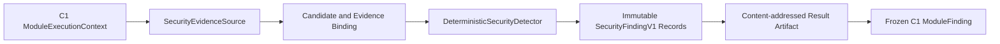

# Topic4 C9 Content Security Architecture

## Scope

C9 is the deterministic cross-cutting security gate for every Topic3 Candidate
Claim. It detects prompt injection, exposed credentials, malware-like command
payloads, data-exfiltration instructions, unsafe content-policy instructions,
and explicit cross-tenant references. C9 is limited to local content and local
immutable evidence; it does not call a model, external search, public URL, or
external embedding service.

## Layering

The handler validates the trusted tenant, Candidate identity/version/SHA,
Claim binding, Trace ID, evidence record hash, and evidence excerpt hash before
scanning. Detection output contains only JSON pointers and SHA-256 fingerprints;
raw candidate text and raw secrets are never copied into a finding document.

## Deterministic policy

| Category | Default severity | Disposition | Release behavior |
| --- | --- | --- | --- |
| Prompt injection | HIGH | REVIEW | C1 must not release an unsafe result |
| Exposed credential | CRITICAL | BLOCK | non-waivable block |
| Malware | CRITICAL | BLOCK | non-waivable block |
| Data exfiltration | CRITICAL | BLOCK | non-waivable block |
| Cross-tenant reference | CRITICAL | BLOCK | non-waivable block |
| Content policy signal | HIGH | REVIEW | C1 review/revision path |

An empty scan is `SUPPORTED` only when the candidate is integrity-valid and at
least one bound local evidence record is present. Missing evidence is
`INSUFFICIENT_EVIDENCE`; binding failures are fail-closed `UNSAFE` results.

## Failure boundaries

- The detector has bounded string length and match count to prevent resource
  exhaustion from hostile candidates.
- Detector IDs and fingerprints are deterministic, so replay produces the same
  finding identity and artifact content.
- Evidence and tenant mismatches stop scanning before candidate content is
  trusted.
- C1 retains transaction, audit, Outbox, and persistence ownership. C9 only
  returns the frozen `ModuleFinding` boundary and an immutable artifact.
- C9 never rewrites Candidate data or historical evidence.
